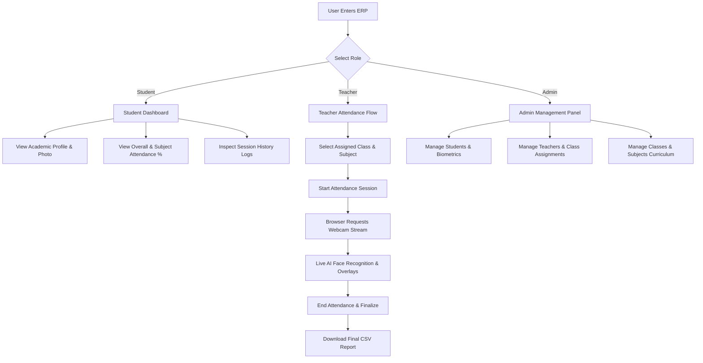

# AI-Based Face Recognition Attendance System

[](docker-compose.yml)
[](https://fastapi.tiangolo.com)
[](https://react.dev)
[](https://github.com/deepinsight/insightface)
[](https://www.mongodb.com)

A modern, privacy-conscious classroom attendance ERP powered by client-side browser webcam acquisition, containerized deep learning inference (**InsightFace SCRFD + ArcFace**), a high-performance **FastAPI** backend, and an interactive **React** portal.

---

## Table of Contents

- [Overview](#overview)
- [Key Features](#key-features)
- [System Architecture](#system-architecture)
- [AI Recognition Pipeline](#ai-recognition-pipeline)
- [Browser Camera Architecture](#browser-camera-architecture)
- [Real-Time Recognition UI](#real-time-recognition-ui)
- [Application Workflow & User Roles](#application-workflow--user-roles)
- [Student Enrollment & Biometric Pipeline](#student-enrollment--biometric-pipeline)
- [Attendance Workflow & Invariants](#attendance-workflow--invariants)
- [Technology Stack](#technology-stack)
- [Project Structure](#project-structure)
- [Database & Data Models](#database--data-models)
- [Running the Project Locally](#running-the-project-locally)
- [API / Service Overview](#api--service-overview)
- [Automated Testing & Verification](#automated-testing--verification)
- [CI/CD Security Gates](#cicd-security-gates)
- [Security & Reliability](#security--reliability)
- [Doorway Mode Status](#doorway-mode-status)
- [Liveness (Anti-Spoofing)](#liveness-anti-spoofing)
- [Known Limitations](#known-limitations)
- [Future Improvements](#future-improvements)

---

## Overview

Traditional computer vision attendance systems often rely on server-side video capture (such as `cv2.VideoCapture`), which introduces severe friction in containerized environments (Docker device passthrough, host permission locks, and hardware virtualization limits).

This project implements a **browser-owned physical camera architecture**:
1. The instructor's web browser captures frames from the physical laptop webcam or USB camera via standard HTML5 `navigator.mediaDevices.getUserMedia()`.
2. Captured JPEG frames are sent to the **FastAPI backend** with the teacher's login token. The backend checks that the teacher owns the session and that it is active.
3. The backend forwards the frame to the internal **Vision Inference Service**, where **SCRFD** detects faces and **ArcFace** extracts 512-dimensional normalized biometric embeddings.
4. Cosine similarity matching evaluates the face against the student gallery, which the vision service loads from the backend.
5. The vision service returns a **signed recognition result**. The backend verifies it, checks the class roster, and records attendance in **MongoDB** idempotently. The browser never talks to the vision service and never asserts an identity.
6. The browser renders real-time bounding boxes, student names, and match confidence percentages over the live camera canvas.

---

## Key Features

- **Browser-Owned Webcam**: Zero native Python camera processes required on the host. The browser directly owns and accesses the physical camera via standard Web APIs.
- **Genuine 512-D ArcFace Biometrics**: Real normalized facial embeddings extracted via InsightFace ONNX models. Zero pseudo-hash or fallback dummy embeddings.
- **Dynamic Vision Gallery**: Newly registered students are dynamically synced to the vision service in real time without requiring a container restart.
- **Real-Time Visual Overlay**: Canvas-rendered face bounding boxes, recognized student names, match percentage badges, and `UNKNOWN` rejection labels.
- **One-Time Idempotent Attendance**: Recognized students are marked `PRESENT` once per session. Subsequent sightings return `already_present` without duplicate records.
- **Roster-Aware Attendance**: Automatically binds academic class rosters (`DS-B`, `CS-A`). Unscanned students remain `ABSENT` upon session finalization.
- **Profile Photo Persistence**: Uploaded student photos are persisted to backend storage, exposed via a dedicated HTTP image endpoint, and displayed on student and admin profiles.
- **Full Role-Based ERP**: Multi-role platform with dedicated workflows for **Students**, **Teachers**, and **Admins**.
- **CSV Attendance Export**: Instantly download finalized attendance reports with one click.
- **Containerized Stack**: Standard Docker Compose architecture containing MongoDB, FastAPI backend, Nginx-served React frontend, and the Vision Inference service.

---

## System Architecture

```text
 Physical Webcam (Laptop / USB / phone as USB webcam)
              │
              ▼
   Chrome / Modern Browser  ── Teacher ERP Dashboard (:3000)
   ├── navigator.mediaDevices.getUserMedia()
   ├── HTML5 <video> Element
   └── <canvas> Frame Extractor
              │
              ├── POST /api/v1/attendance/{session_id}/process-frame
              │   (JPEG frame + teacher JWT)
              ▼
   FastAPI Attendance Backend (:8000)
   ├── JWT Auth, Session Ownership, Session Must Be ACTIVE
   ├── Rate Limiting (per session and per teacher)
   ├── Verifies Signed Recognition Results (HMAC, 30 s expiry, no replay)
   ├── Session Roster Validation & Manual-Correction Lock
   └── Idempotent Attendance Engine
              │                         ▲
              │ frame + service key     │ signed recognition result
              ▼                         │
   Vision Service (internal only, no published port)
   ├── SCRFD 0.5G Face Detector
   ├── ArcFace 512-d Extractor
   ├── Gallery Loaded From the Backend (never from a file)
   └── Ambiguity & Margin Guard (sim >= 0.50, margin >= 0.15)

   FastAPI Attendance Backend
              │
              ▼
   MongoDB Database (:27017)
   ├── student_profiles & users
   ├── biometric_profiles (mean 512-d vectors)
   ├── sessions & session_rosters
   └── attendance_records
              │
              ▼
   Teacher ERP Dashboard (:3000)
   └── Real-time Attendance List, Overlays & CSV Export
```

---

## AI Recognition Pipeline

The computer vision architecture strictly decouples **detection**, **recognition**, and **attendance business logic**:

```text
Raw Frame ──► [Face Detection: SCRFD] ──► Bounding Boxes & Landmarks
                       │
                       ▼
             [Face Alignment & Cropping] ──► 112x112 Aligned Face
                       │
                       ▼
             [Feature Extraction: ArcFace] ──► 512-d L2-Normalized Vector
                       │
                       ▼
             [Gallery Cosine Similarity] ──► Best Match + Runner-Up Score
                       │
                       ▼
             [Margin & Threshold Gate] ──► Confirmed Identity or UNKNOWN
                       │
                       ▼
             [Attendance State Machine] ──► One-Time PRESENT in Active Session
```

### Clarifying Detection vs. Recognition vs. Attendance

| Stage | Responsibility | Mechanism |
| :--- | :--- | :--- |
| **Face Detection** | Locates *where* human faces exist in the camera frame. | **SCRFD (Sample and Computation Redistribution for Face Detection)**: Produces bounding boxes `[x1, y1, x2, y2]` and facial landmarks. Does not identify who the person is. |
| **Face Recognition** | Determines *who* the detected face belongs to. | **ArcFace (Additive Angular Margin Loss)**: Computes a 512-dimensional normalized embedding vector. Calculates cosine similarity $S = \vec{v}_{\text{face}} \cdot \vec{v}_{\text{gallery}}$. Evaluates threshold ($S \ge 0.50$) and runner-up margin ($S_1 - S_2 \ge 0.15$). |
| **Attendance Marking** | Records verifiable academic presence. | **FastAPI Attendance Service**: Validates that the recognized identity is part of the active session's class roster, confirms presence, marks status as `PRESENT` idempotently, and prevents duplicate marks. |

---

## Browser Camera Architecture

### Why the Browser Owns the Physical Webcam

In previous iterations, native Python processes used OpenCV `cv2.VideoCapture(0)` to read directly from DirectShow or V4L2. However, in containerized or server-client setups, this causes major architectural flaws:
1. **Container Isolation**: Docker containers cannot directly bind to local host webcams without complex, OS-specific device mapping (`/dev/video0`) which fails on Windows Docker Desktop.
2. **Device Locking**: Exclusive OS webcam locks prevent multiple processes from viewing the stream.
3. **No Client Hardware Access**: A web application running in a user's browser cannot command a remote server to "grab" the client's local USB camera.

### How It Works Now
- The browser requests webcam permission via standard `navigator.mediaDevices.getUserMedia({ video: { width: 1280, height: 720 } })`.
- Supported devices include integrated laptop cameras, external USB webcams, and mobile devices connected as webcams.
- A hidden HTML5 `<canvas>` extracts video frames at ~2–3 FPS as compressed JPEG blobs and posts them to the backend route `/api/v1/attendance/{session_id}/process-frame` with the teacher's token.
- When the teacher ends attendance, `stream.getTracks().forEach(track => track.stop())` is called immediately, cleanly releasing the camera hardware indicator in Windows.

---

## Real-Time Recognition UI

During an active session, the camera feed renders live visual feedback directly on top of the `<video>` element using an overlay `<canvas>`:

```text
+-----------------------------------------------------------+
|                                                           |
|       +-------------------+                               |
|       |  [0.92]           |                               |
|       |  Alex Example     | <--- Green Box (Recognized)   |
|       |  92.3%            |                               |
|       +-------------------+                               |
|                                     +---------------+     |
|                                     |  [0.18]       |     |
|                                     |  UNKNOWN      |     |
|                                     |  18.2%        |     |
|                                     +---------------+     |
|                                       ^                   |
|                                       |-- Red Box         |
|                                                           |
+-----------------------------------------------------------+
```

- **Recognized Students**: Drawn with green bounding boxes displaying the student name and confidence percentage (e.g., `Alex Example (92.3%)`).
- **Unknown Faces**: Drawn with red bounding boxes displaying `UNKNOWN` when similarity falls below the threshold ($< 0.50$) or margin is insufficient ($< 0.15$).
- **Multi-Face Tracking**: Multiple students in frame are detected, bounded, and labeled simultaneously.

---

## Application Workflow & User Roles

The system supports three distinct user roles governed by JWT authentication and RBAC:



### 1. Student Role
- **Self-Service Registration**: Upload personal photograph, student ID, roll number, department, and section. The registration waits for an administrator's approval; until then the student cannot sign in and their face is not recognized.
- **Photo Changes**: A new photo is stored for review. The photo in use stays in effect until an administrator approves the new one.
- **Student Profile**: View official academic profile photo, department credentials, and biometric status.
- **Attendance Analytics**: View aggregate attendance percentage, subject-wise attendance breakdown, and complete attendance history.

### 2. Teacher Role
- **Registration**: A teacher can register, but cannot sign in until an administrator approves the account and assigns its classes.
- **Assigned Classes**: Teachers can only start sessions for classes explicitly assigned to them by administrators. A session for any other class, or with no class, is refused.
- **One-Click Attendance**: Initiate an attendance session with automatic student roster population (`ABSENT` by default).
- **Live Recognition Feed**: Monitor recognized students in real time with audio-visual confirmation.
- **Session Finalization & Export**: Finalize attendance records and download clean CSV reports (`<Course>_attendance_<session_id>.csv`).

### 3. Administrator Role
- **Pending Approvals**: Review new student and teacher registrations and student photo changes. Approving a teacher assigns their classes; approving a student confirms their class. Rejecting removes everything the registration submitted. Registrations left untouched for 14 days are removed automatically.
- **Student Directory**: View all registered students with profile photo thumbnails and biometric status.
- **Teacher Assignment**: Assign specific branches and sections (`DS-B`, `CS-A`) and subjects to faculty members.
- **Curriculum Management**: Create academic departments, classes, and subjects.

---

## Student Enrollment & Biometric Pipeline

```text
1. Student registers on Web UI (Name, ID, Section, Photo)
                    │
                    ▼
2. Backend receives multipart/JSON request
                    │
                    ▼
3. Photo bytes persisted to the uploads volume: /data/uploads/student_profiles/{id}.jpg
                    │
                    ▼
4. POST /extract-embedding to Vision Service (timeout: 25s)
                    │
         ┌──────────┴──────────┐
         ▼                     ▼
   Face Detected         No Face Detected
         │                     │
         ▼                     ▼
   ArcFace ONNX          Registration Fails (HTTP 400)
   512-d Normalized      "No face detected in photo.
   Embedding Vector       Please upload clear photo."
         │
         ▼
5. Upsert biometric_profiles in MongoDB
                    │
                    ▼
6. POST /enroll-student to Vision Service
                    │
                    ▼
7. Identity added to the in-memory gallery (never written to disk)
                    │
                    ▼
8. Instantly recognizable in live attendance without restart
```

> [!IMPORTANT]
> **No Dummy Fallback Guarantee**: The legacy pseudo-hash (SHA-512) fallback vector mechanism has been completely excised. If a clear frontal face cannot be extracted, registration aborts with an informative error message.

---

## Attendance Workflow & Invariants

### State Machine Invariants
1. **One-Time Marking**: When a student is recognized, a single record with status `PRESENT` is created. Subsequent detections of the same student during that session return status `already_present` without duplicate events.
2. **Session-Scoped Roster**: Only students enrolled in the class being taught (or dynamically recognized) are processed.
3. **Unknown Rejection**: Faces classified as `UNKNOWN` or with similarity $< 0.50$ are rejected by the backend and never marked present.
4. **Finalization Completeness**: When the session ends, students who were never recognized remain marked as `ABSENT`.

---

## Technology Stack

| Layer | Component | Version / Library | Purpose |
| :--- | :--- | :--- | :--- |
| **Frontend** | React SPA | React 19, TypeScript, Vite 8 | User interface, authentication state, ERP dashboards |
| **Webcam Engine** | HTML5 Media API | `getUserMedia()`, HTML5 Canvas | Browser hardware capture and JPEG frame serialization |
| **Backend API** | FastAPI | Python 3.12, Uvicorn, Motor | Async REST API, JWT auth, business logic |
| **Database** | MongoDB | MongoDB 7.0 | Persistent document storage for users, profiles, and attendance |
| **Face Detection** | InsightFace SCRFD | SCRFD-0.5G ONNX | Lightweight, high-accuracy edge face detection |
| **Face Recognition**| ArcFace | MobileFaceNet / ResNet ONNX | 512-dimensional discriminative facial feature extraction |
| **Vision Server** | aiohttp / OpenCV | Python 3.11, aiohttp, OpenCV Headless | Frame processing, embedding matching, gallery caching |
| **Web Server** | Nginx | Nginx Unprivileged 1.27 Alpine | Reverse proxy for frontend assets and backend API routing |
| **Containerization**| Docker Compose | Multi-container compose | Local orchestration with isolated internal bridge networks |

---

## Project Structure

```text
anti_proxy_project/
├── backend/
│   ├── app/
│   │   ├── api/
│   │   │   ├── dependencies/       # JWT auth guards & role verifiers
│   │   │   └── routes/             # REST endpoints (auth, sessions, attendance, students)
│   │   ├── core/                   # Configuration, security logging, environment
│   │   ├── database/               # Motor MongoDB repositories & indexes
│   │   ├── schemas/                # Pydantic data schemas & response models
│   │   ├── security/               # Password hashing (bcrypt) & JWT issuance
│   │   ├── services/               # Biometrics, student registration, attendance logic
│   │   └── main.py                 # FastAPI application factory & static mounts
│   ├── tests/                      # Pytest unit and integration test suites
│   ├── Dockerfile                  # Production FastAPI container specification
│   └── requirements.txt            # Python dependencies for backend service
├── frontend/
│   ├── src/
│   │   ├── api/                    # Axios / Fetch client wrappers
│   │   ├── components/             # Reusable UI components (LiveAttendanceFeed, modals)
│   │   ├── pages/                  # TeacherAttendanceFlow, StudentDashboard, AdminDashboard
│   │   ├── services/               # API service layer with authentication interceptors
│   │   └── types/                  # TypeScript interface definitions
│   ├── nginx.conf                  # Nginx SPA and reverse proxy configuration
│   ├── Dockerfile                  # Multi-stage Vite build and unprivileged Nginx runtime
│   └── package.json                # Frontend dependencies & test scripts
├── vision-service/
│   ├── camera/
│   │   └── vision_api.py           # Internal key-protected API: frame recognition, embeddings, gallery sync
│   ├── detection/                  # SCRFD ONNX model wrappers
│   ├── recognition/                # ArcFace embedding extraction & similarity matching
│   ├── tests/                      # Vision unit tests (biometric fixtures live outside the repo)
│   ├── Dockerfile                  # Python container with InsightFace & ONNX Runtime
│   └── requirements.txt            # Vision service dependencies
├── docker-compose.yml              # Local orchestration stack specification
├── .env.example                    # Template environment variables
└── README.md                       # Project documentation
```

---

## Database & Data Models

The system uses MongoDB with the following collections:

- `users`: Credentials, hashed passwords (`bcrypt`), and assigned role (`STUDENT`, `TEACHER`, `ADMIN`).
- `student_profiles`: Academic credentials (`student_id`, `roll_number`, `branch`, `section`, `class_code`, `photo_url`, `has_biometric`).
- `teacher_profiles`: Faculty information and allowed classes (`assigned_classes`, `assigned_subjects`).
- `academic_classes` & `academic_subjects`: Department curriculum structure (`DS-B`, `CS-A`).
- `biometric_profiles`: Extracted ArcFace 512-dimensional mean embedding vector (`mean_embedding`), quality scores, and enrolled timestamp.
- `sessions`: Scheduled and active attendance sessions (`course_name`, `class_code`, `status`, `start_time`, `end_time`).
- `session_rosters`: List of student identities belonging to an attendance session.
- `attendance_records`: Per-student attendance records for a session (`status`: `PRESENT` or `ABSENT`, `marked_at`).
- `audit_logs`: Immutable audit trails for manual status corrections.

---

## Running the Project Locally

### Prerequisites
- [Docker Desktop](https://www.docker.com/products/docker-desktop/) (with Docker Compose v2)
- Node.js 20+ (optional, for local frontend development)
- Python 3.11+ (optional, for local script execution)

### 1. Clone & Configure Environment
```bash
git clone https://github.com/krishtewatia/anti_proxy_attendance.git
cd anti_proxy_attendance
cp .env.example .env
```

Open `.env` and replace every `replace_with_...` value with your own secret. The stack refuses to start until `RECOGNITION_SIGNING_KEY` is a real value. Generate each secret with:

```bash
python -c "import secrets; print(secrets.token_hex(32))"
```

### 2. Launch Stack with Docker Compose
```bash
docker compose up -d --build
```

Verify service status:
```bash
docker compose ps
```
All four containers should report `healthy` or `Up`:
- `anti-proxy-mongodb` (`localhost:27017`, bound to this machine only)
- `anti-proxy-backend` (`localhost:8000`)
- `anti-proxy-frontend` (`localhost:3000`)
- `anti-proxy-vision-service` (internal only: it has no published port and is called by the backend)

The vision service and the frontend run only what their images contain, so after pulling new commits or switching branches start the stack with `--build` again. If `anti-proxy-vision-service` shows `Restarting`, its image is older than the code: rebuild it.

### 3. Create the Admin and Teacher Accounts
Admin accounts cannot be created from the web portal. There are two ways to create the first one.

**Option A: from the environment (no seed data).** Set these two values in `.env`, start the stack, then remove them again:

```bash
BOOTSTRAP_ADMIN_EMAIL=you@example.edu
BOOTSTRAP_ADMIN_PASSWORD=<at least 12 characters>
```

The backend creates that administrator at start-up only if no administrator exists yet. There is no default password, an existing administrator is never changed, and the backend logs a warning for as long as the two values are still set after the account exists. Sign in, then approve teachers and students from **Pending Approvals**.

**Option B: the seed script (an admin, an approved teacher and the class catalog).** It needs `pymongo` and `bcrypt` on the machine you run it from:

```bash
pip install pymongo bcrypt
```

```bash
python scripts/seed_clean_demo.py --no-demo-students --admin-password "<your admin password>" --teacher-password "<your teacher password>"
```

> [!WARNING]
> The seed script **purges the application collections** in the target database before seeding. Run it on a fresh database, not on one whose data you want to keep.

It creates:

| Role | Email | Password | Scope |
| :--- | :--- | :--- | :--- |
| **Admin** | `admin@system.local` | the `--admin-password` you passed (default `AdminDevPass123!`) | System administration |
| **Teacher** | `teacher@demo.edu` | the `--teacher-password` you passed (default `TeacherDevPass123!`) | Classes `DS-B`, `DS-C` |

It also creates the starting academic catalog (classes such as `DS-B`, `CS-A` and their subjects). No students, sessions or attendance records are created. Change the default passwords before using the system with real people.

### 4. Use It With Your Own Data
The repository ships with **no face photos, no embeddings and no student records**. Everyone who uses the system enrolls their own.

1. **Admin** signs in at [http://localhost:3000](http://localhost:3000), adds or edits classes and subjects, and assigns classes to teachers. More teachers can register themselves from the sign-up page.
2. **Each student** registers from the sign-up page with their own details and a clear, front-facing photo. The photo is turned into a face embedding and stored in your database; registration is rejected if no face is found.
3. **A teacher** opens the attendance flow, picks an assigned class and subject, selects a camera (a laptop webcam, a USB webcam, or a phone connected as a USB webcam), and starts the session. Recognized students on the class roster are marked present once.
4. **The teacher** ends the session and downloads the CSV. A teacher can correct any record by hand; corrections are audited and are never overwritten by the camera.

Student photos are stored on a named Docker volume (`anti_proxy_uploads`, mounted in the backend container at `/data/uploads`) and embeddings in MongoDB. Both stay on your machine. The photos are deliberately kept outside the source tree: nothing is written under `./backend`, so they cannot end up in git or in a Docker image, and the backend refuses to start if `UPLOADS_DIR` points inside the repository. When the backend is run without Docker, photos go to `~/.anti_proxy_attendance/uploads` unless `UPLOADS_DIR` is set.

To see or remove the stored photos:

```bash
docker run --rm -v anti_proxy_uploads:/data alpine ls -l /data/student_profiles
```

```bash
docker volume rm anti_proxy_uploads
```

The second command deletes every stored photo; stop the stack first.

**Moving photos from an older checkout.** Versions before the uploads volume kept photos in `backend/uploads/`. To move them, run this once from the folder that holds `docker-compose.yml`, with the stack running:

```bash
docker compose run --rm --no-deps -v "/path/to/old/backend/uploads:/legacy_uploads:ro" backend python -m app.tools.migrate_uploads --source /legacy_uploads --dry-run
```

Remove `--dry-run` to copy. Each photo is checked against the student it is named after: it must be identical to the copy in the student record, or its face must match the student's enrolled template (checked by the vision service). A photo that matches no student or fails the check is not copied; one that cannot be checked is left behind unless `--include-unverified` is given. Photos that exist only inside a student record are written out too. The command prints counts and ends with either `SAFE TO DELETE the old folder` or the list of photos that still need attention. It never deletes or changes the old folder.

### 5. Other Endpoints
- **FastAPI OpenAPI Docs**: [http://localhost:8000/docs](http://localhost:8000/docs)

---

## API / Service Overview

### Backend Core Routes (`:8000`)

| Method | Endpoint | Access | Description |
| :--- | :--- | :--- | :--- |
| `POST` | `/api/v1/auth/register` | Public, rate-limited | Register an account. It is `PENDING` until an administrator approves it |
| `GET` | `/api/v1/admin/approvals` | Admin | Registrations and photo changes waiting for approval |
| `POST` | `/api/v1/admin/approvals/{user_id}/approve` | Admin | Approve a registration (assign a teacher's classes, confirm a student's class) |
| `POST` | `/api/v1/admin/approvals/{user_id}/reject` | Admin | Reject a registration and remove everything it submitted |
| `POST` | `/api/v1/auth/login` | Public | Authenticate and obtain JWT access token |
| `POST` | `/api/v1/students/register` | Public | Self-service student registration with photo & biometrics |
| `GET` | `/api/v1/students/me` | Student | Get authenticated student's profile & attendance metrics |
| `GET` | `/api/v1/students/{student_id}/photo` | Public / Proxy | Serve student profile photograph (JPEG) |
| `POST` | `/api/v1/sessions` | Teacher | Create new active attendance session for class |
| `GET` | `/api/v1/sessions/active` | Teacher | Query current active session for teacher |
| `GET` | `/api/v1/attendance/{session_id}` | Teacher | Retrieve full student roster & live attendance statuses |
| `POST` | `/api/v1/attendance/{session_id}/process-frame` | Teacher (session owner, session ACTIVE) | Recognize faces in one camera frame and mark verified, rostered students `PRESENT` |
| `PATCH` | `/api/v1/attendance/{session_id}/records/{attendance_id}` | Teacher | Audited manual correction; locks the record against later recognitions |
| `GET` | `/api/v1/attendance/{session_id}/export` | Teacher | Download attendance roster as formatted CSV |
| `POST` | `/api/v1/sessions/{session_id}/finalize` | Teacher | Finalize session and lock records |

### Vision Service Routes (internal only)

The vision service has no published port. Only the backend calls it, over the internal Docker network, and every route except `/health` requires the shared service key (`X-API-Key`).

| Method | Endpoint | Description |
| :--- | :--- | :--- |
| `GET` | `/health` | Liveness probe (no key required) |
| `GET` | `/status` | Service status and pipeline metrics |
| `GET` | `/gallery` | Identities currently in memory (no embeddings) |
| `POST` | `/process-frame` | One frame in; boxes, similarity and a signed recognition result per confirmed face out |
| `POST` | `/extract-embedding` | Extract a 512-d ArcFace vector from a registration photo |
| `POST` | `/enroll-student` | Add a newly registered identity to the in-memory gallery |
| `POST` | `/reload-gallery` | Reload the gallery from the backend |

--- | :--- | :--- |
| `GET` | `/status` | Service status, pipeline status, and memory metrics |
| `GET` | `/gallery` | List of all enrolled identities currently in memory |
| `POST` | `/process-frame` | Submit browser frame (JPEG); returns bounding boxes, similarity, and recognition status |
| `POST` | `/extract-embedding` | Extract 512-d ArcFace vector from uploaded image |
| `POST` | `/enroll-student` | Dynamically register identity and vector into live gallery |
| `POST` | `/reload-gallery` | Synchronize live gallery directly from MongoDB via backend API |

---

## Automated Testing & Verification

### Run Backend Unit & Integration Tests
```bash
docker exec anti-proxy-backend pytest -v
```

The suite sends every upload it makes to a temporary directory, so running it inside the container does not touch the uploads volume or the source tree.

### Run Backend Integration Tests (Demo Data + Vision Service)

Tests marked `@pytest.mark.integration` (`test_one_time_demo_e2e.py`, `test_phase2_multi_role_e2e.py`) log in with the seeded demo accounts and call the vision service, so CI excludes them with `-m "not integration and not slow and not needs_models"`. To run them locally:

```bash
docker compose up -d --build
```

```bash
python scripts/seed_clean_demo.py
```

```bash
docker exec anti-proxy-backend pytest -m integration -v
```

The stack must be healthy first (`docker compose ps`), because the tests need MongoDB with the demo admin, teacher and students (seed with a fixtures folder, see below), and a running vision service.

### Run Frontend Contract & E2E Tests
```bash
cd frontend
npm ci
npm test
npm run build
```

### Run Vision Service Attendance Tests
```bash
docker exec anti-proxy-vision-service python -m unittest discover tests/
```

### Biometric Test Fixtures (Not in the Repository)

Face photos, video clips, sampled frames and embeddings of the volunteer test subjects are biometric data. They are **not stored in git** and are not distributed with this project. Tests and tools that need them read a local folder named by `VISION_FIXTURES_DIR`; without it, those tests skip.

Expected layout:

```text
<VISION_FIXTURES_DIR>/
├── recognition_benchmark/person_01..04/   # enrollment photos per subject
├── video_test/                            # *.mp4 clips and sampled_frames/
├── multi_person_output/                   # frames written by the benchmark tools
└── benchmark_embeddings.json              # used by scripts/seed_clean_demo.py
```

How to obtain them:

- **Project maintainers**: use the private copy kept by the project owner. Do not commit it, upload it, or bake it into an image.
- **Everyone else**: collect your own data from consenting adult volunteers, following `docs/evaluation/collection_protocol.md`, and arrange it in the layout above.

Run the fixture-dependent vision tests locally (they need the InsightFace models too):

```bash
VISION_FIXTURES_DIR=/path/to/fixtures pytest -m "needs_models or slow" tests/test_real_cv_attendance_e2e.py
```

### Run the End-to-End Smoke Test

One script runs the whole secured flow over HTTP: register two students with a photo, create and start a session, send camera frames with the teacher's token, apply a manual correction, finalize, and export the CSV. It also checks that frames without a token, the removed `/mark` routes and the vision service port are all refused.

```bash
python scripts/smoke_e2e.py --photos /path/to/photos
```

By default it builds the images, starts a throwaway stack under a random Compose project name with generated secrets and an in-memory database, runs the checks, and removes the stack again. It does not touch the development stack. `--photos` needs one folder per person with at least three face photos each; if it is omitted, `$VISION_FIXTURES_DIR/recognition_benchmark` is used. Photos are never read from the repository.

To check a running deployment instead (for example after a deploy):

```bash
SMOKE_ADMIN_EMAIL=... SMOKE_ADMIN_PASSWORD=... python scripts/smoke_e2e.py --base-url https://your-host --photos /path/to/photos
```

Registrations need an administrator's approval, so the run needs an admin account to approve the teacher and students it registers. The throwaway stack creates its own. Against a deployment, supply an administrator as above; optionally add `SMOKE_TEACHER_EMAIL` and `SMOKE_TEACHER_PASSWORD` to reuse an approved teacher who is assigned the class given by `--class-code`.

In that mode the script registers a smoke-test teacher per run and two smoke-test students once (`SMOKEA` and `SMOKEB`), reuses the students on later runs, and creates one new session per run. Nothing is deleted. The exit code is 0 only if every check passes.

---

## CI/CD Security Gates

Every push and pull request to `main` runs two GitHub Actions workflows: `ci.yml` (Continuous Integration) and `security.yml` (DevSecOps & Security Scanning, which also runs every Monday). Together they produce ten status checks, and all ten must pass before a change is merged.

| Status check | Tool | Fails when |
| :--- | :--- | :--- |
| **Backend Tests & Coverage** | pytest + pytest-cov, with a MongoDB 7 service | Any test fails, or backend coverage is below **75%**. The threshold should only ever go up. Tests marked `integration`, `slow` or `needs_models` are excluded. |
| **Vision Service Fast Tests** | pytest (model-free suites) | Any test fails. |
| **Frontend Lint & Build** | Oxlint, TypeScript (`tsc -b`), Vite build, frontend test suites | Any lint error, type error, build failure or failing suite. Lint warnings do not fail the check. |
| **Secret Scanning (Gitleaks)** | Gitleaks, default rules plus `.gitleaks.toml` | Any secret is found in the pushed commits. Only `backend/tests/` and the CI placeholder JWT value are allowlisted. |
| **Code Scanning (Semgrep)** | Semgrep `--config auto --error`, with `.semgrepignore` | Any finding at all. Results are also uploaded to the Code scanning tab. |
| **Python Security (Bandit & pip-audit)** | Bandit (`-c pyproject.toml -ll -ii`) on backend and vision-service; pip-audit on both requirements files | Bandit reports a finding of **medium or higher** severity and confidence, or pip-audit finds **any** known vulnerability. |
| **Node Security (npm audit)** | `npm audit --audit-level=high` | Any **high or critical** advisory in the frontend dependencies. |
| **Container Scanning (Trivy) - backend** | Trivy image scan of the freshly built backend image | Any **HIGH or CRITICAL** vulnerability that has a fix available. |
| **Container Scanning (Trivy) - frontend** | Trivy image scan of the freshly built frontend image | Any **HIGH or CRITICAL** vulnerability that has a fix available. |
| **Container Scanning (Trivy) - vision-service** | Trivy image scan of the freshly built vision-service image | Any **HIGH or CRITICAL** vulnerability that has a fix available. |

Supporting controls:

- **Pinned actions**: every GitHub Action is pinned to a full commit SHA, with the version in a trailing comment so Dependabot can still update it.
- **Dependabot cooldown**: updates are proposed 7 days after a release, not immediately.
- **Pre-commit hooks**: the same Gitleaks, Ruff and Bandit checks run locally before each commit (`.pre-commit-config.yaml`).

---

## Security & Reliability

- **Secret Key Validation**: Startup checks enforce that `JWT_SECRET_KEY` meets high-entropy length requirements (minimum 32 characters).
- **CORS Configuration**: Explicit origin whitelisting (`http://localhost:3000`) prevents cross-site request abuse while allowing browser webcam frame submission.
- **Payload Limits**: Vision service and backend middleware reject oversized payloads to mitigate memory exhaustion.
- **Ambiguity Guard**: Recognition enforces both a minimum similarity threshold ($S \ge 0.50$) and a runner-up margin ($S_1 - S_2 \ge 0.15$), preventing false positives when multiple students share similar facial features.
- **Data Protection**: User profile photos and raw biometric vectors are stored locally on persistent Docker volumes and excluded from Git version control.

---

## Doorway Mode Status

The repository also contains a doorway (entry/exit) pipeline: SCRFD detection, ByteTrack tracking, boundary-crossing direction logic, and a presence engine that turns entry and exit events into time-in-room. **Doorway mode is offline-tested and has no live ingest.** It is exercised by recorded-video tests, and its events API and presence engine are covered by the backend suite, but no camera feeds it live. Phone WebRTC ingest was removed; see [ADR-010](docs/adr/ADR-010-drop-webrtc-phone-ingest.md). To use a phone as the attendance camera, connect it by USB in webcam mode and pick it in the camera dropdown.

---

## Liveness (Anti-Spoofing)

Every face that is recognized as a student is checked by a passive liveness model before the vision service signs the result, so that a printed photo or a face on a screen is not marked. The model is the MiniFASNet ensemble from [Silent-Face-Anti-Spoofing](https://github.com/minivision-ai/Silent-Face-Anti-Spoofing) (Apache-2.0), converted to ONNX; it adds about 6 ms per recognized face on CPU. See [ADR-011](docs/adr/ADR-011-passive-liveness-gate.md) for the design, the threat model and how the model files were produced.

`LIVENESS_MODE` in `.env` controls it, for the backend and the vision service together:

| Mode | What happens |
|---|---|
| `observe` (current default) | Faces are checked and the outcome is logged. Nothing is blocked. |
| `enforce` | A face that fails is never marked. The teacher sees a red "Spoof detected" box, the attempt is written to the audit log, and the backend accepts only results signed as "liveness passed". |

The default stays `observe` until the threshold has been calibrated on a measured attack set. To capture that set and measure false accepts and false rejects, follow [docs/evaluation/liveness_capture_guide.md](docs/evaluation/liveness_capture_guide.md). The measurement so far covers one person and one camera; it is not a general accuracy claim.

---

## Known Limitations

- **Single Active Session per Teacher**: Teachers are restricted to one active attendance session at a time.
- **Liveness is not yet enforced by default**: the gate runs in observe mode until its threshold is calibrated, so a held-up photo is logged but still marked unless `LIVENESS_MODE=enforce` is set. It has been measured on one person and one camera only.
- **2D Facial Recognition**: The standard ArcFace pipeline uses 2D RGB frames without depth-sensing hardware; extreme angles or severe lighting variations can reduce match confidence.
- **Client Processing**: Browser frame extraction frequency depends on the client machine's processing power.

---

## Future Improvements

- **Cloud Object Storage**: Transition from local volume mounts to S3/GCS object storage for student photographs.
- **Liveness in enforce mode by default**: calibrate the threshold on the measured attack set and switch the default from observe to enforce (ADR-011). Later: an active challenge for faces in an uncertain score band, and a liveness check at enrollment.
- **Distributed Inference**: Scale vision processing across a worker queue (e.g., Celery / Redis) for university-wide simultaneous multi-classroom deployments.
- **Automated CI/CD**: Implement automated build pipelines with GPU runner acceleration for ONNX inference benchmarking.
