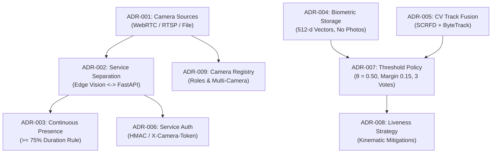

# Architecture Decision Records (ADRs)

This directory maintains the immutable log of architectural decisions for the **Anti-Proxy Automated Attendance System**. Each record captures the context, problem statement, evaluation of options, decision rationale, and system consequences.

---

## Architecture Decision Records Index

| ADR ID | Title | Date | Status | Core Decision & Architectural Impact |
| :---: | :--- | :---: | :---: | :--- |
| [**ADR-001**](file:///docs/adr/ADR-001-camera-architecture.md) | Camera Architecture | 2026-09 | **Accepted** | Decoupled video ingestion into an extensible `VideoSource` abstraction supporting WebRTC (phone streaming), RTSP (CCTV cameras), and offline MP4 file sources. |
| [**ADR-002**](file:///docs/adr/ADR-002-vision-backend-separation.md) | Vision / Backend Separation | 2026-09 | **Accepted** | Enforced a strict architectural boundary: the edge Vision Service handles perception and emits transit events; the FastAPI backend manages attendance business logic, session state, and persistence. |
| [**ADR-003**](file:///docs/adr/ADR-003-attendance-calculation.md) | Attendance Calculation Model | 2026-09 | **Accepted** | Replaced vulnerable one-off kiosk scans with continuous presence tracking ($\sum (\text{EXIT} - \text{ENTRY}) / \text{Duration} \ge 75\%$), eliminating buddy punching and proxy attendance. |
| [**ADR-004**](file:///docs/adr/ADR-004-biometric-storage.md) | Biometric Storage & Minimization | 2026-09 | **Accepted** | Enforced privacy-by-design: store only 512-dimensional normalized float vectors in MongoDB; raw facial photos and cropped chips are destroyed in RAM immediately following feature extraction. |
| [**ADR-005**](file:///docs/adr/ADR-005-cv-pipeline-and-track-fusion.md) | CV Pipeline & Track-Level Fusion | 2026-09 | **Accepted** | Combined InsightFace SCRFD face detection with pure NumPy/SciPy ByteTrack (8-state Kalman filtering) to accumulate identity evidence across temporal tracklets rather than single frames. |
| [**ADR-006**](file:///docs/adr/ADR-006-service-to-service-authentication.md) | Service Authentication & Ingestion Security | 2026-10 | **Accepted** | Secured the `/api/v1/events` endpoint using pre-shared camera tokens (`X-Camera-Token` / Bearer), timing-safe comparisons (`secrets.compare_digest`), payload size limits (64 KB), and IP rate limiting (600 req/min). |
| [**ADR-007**](file:///docs/adr/ADR-007-recognition-similarity-threshold.md) | Similarity Threshold Selection & Multi-Frame Confirmation | 2026-10 | **Accepted** | Replaced arbitrary thresholds with an empirically validated baseline $\theta = 0.50$, relative separation margin $\Delta \ge 0.15$, and a 3-vote temporal confirmation rule ($P_{\text{False Confirm}} < 10^{-6}$). |
| [**ADR-008**](file:///docs/adr/ADR-008-anti-spoofing-liveness-strategy.md) | Anti-Spoofing & Liveness Strategy for Local MVP | 2026-10 | **Accepted** | Postponed heavy neural anti-spoofing classifiers to protect CPU frame rates; relied on 4 structural mitigations (kinematic boundary crossing trajectory, 3-vote voting, continuous presence accumulation, teacher review). |
| [**ADR-009**](file:///docs/adr/ADR-009-camera-registry-and-multi-camera-architecture.md) | Camera Registry, Multi-Camera & RTSP Ingestion | 2026-10 | **Accepted** | Introduced a MongoDB-backed camera registry with role enforcement (`ENTRY`, `EXIT`, `BOTH`), secret URL masking, RTSP automatic reconnection with exponential backoff, and outbox persistence. |

---

## ADR Decision Progression & Dependency Graph

