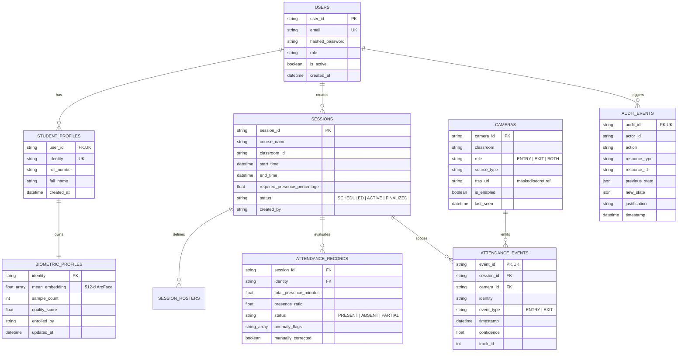

# Database Schema & Indexing Architecture

## 1. Database Overview

The Anti-Proxy Attendance System utilizes **MongoDB 8.0** as its primary persistent datastore. The application interacts with MongoDB asynchronously via the `motor` driver and Pydantic schema validation. For lightweight unit and integration testing without a running MongoDB daemon, the application transparently falls back to an in-memory client (`mongomock-motor`).



---

## 2. Collections & Document Specifications

### 2.1 `users` Collection
Stores human operator credentials and authorization roles:
```json
{
  "_id": {"$oid": "660c1a2b3c4d5e6f7a8b9c0d"},
  "user_id": "usr_9f8e7d6c5b4a",
  "email": "teacher@demo.edu",
  "hashed_password": "$2b$12$e8x...secure_bcrypt_hash...",
  "role": "TEACHER",
  "is_active": true,
  "created_at": "2026-10-01T08:00:00Z"
}
```

### 2.2 `biometric_profiles` Collection
Stores mathematical feature representations extracted by ArcFace. **Raw biometric photos are never stored in the database**:
```json
{
  "_id": {"$oid": "660c1a2b3c4d5e6f7a8b9c0e"},
  "identity": "alice_roll_101",
  "mean_embedding": [-0.0412, 0.0891, -0.0123, "...512 float values...", 0.0543],
  "sample_count": 3,
  "quality_score": 0.884,
  "enrolled_by": "admin@system.local",
  "created_at": "2026-10-01T08:30:00Z",
  "updated_at": "2026-10-01T08:30:00Z"
}
```

### 2.3 `cameras` Collection
Manages physical and virtual camera hardware registered across university classrooms:
```json
{
  "_id": {"$oid": "660c1a2b3c4d5e6f7a8b9c0f"},
  "camera_id": "CAM_ROOM_101_DOOR",
  "classroom": "LH-101",
  "role": "BOTH",
  "source_type": "WEBRTC",
  "rtsp_url": null,
  "is_enabled": true,
  "last_seen": "2026-10-03T11:25:00Z",
  "created_at": "2026-10-01T09:00:00Z"
}
```

### 2.4 `sessions` Collection
Defines scheduled class periods, classroom assignments, and attendance policies:
```json
{
  "_id": {"$oid": "660c1a2b3c4d5e6f7a8b9c10"},
  "session_id": "session_20261003100000",
  "course_name": "CS-101: Computer Science Fundamentals",
  "classroom_id": "LH-101",
  "start_time": "2026-10-03T10:00:00Z",
  "end_time": "2026-10-03T11:00:00Z",
  "required_presence_percentage": 75.0,
  "status": "FINALIZED",
  "created_by": "teacher@demo.edu",
  "created_at": "2026-10-03T09:45:00Z"
}
```

### 2.5 `attendance_events` Collection
Records every validated transit event emitted by edge cameras:
```json
{
  "_id": {"$oid": "660c1a2b3c4d5e6f7a8b9c11"},
  "event_id": "evt_4a5b6c7d8e9f",
  "session_id": "session_20261003100000",
  "camera_id": "CAM_ROOM_101_DOOR",
  "identity": "alice_roll_101",
  "event_type": "ENTRY",
  "timestamp": "2026-10-03T10:02:15Z",
  "confidence": 0.742,
  "track_id": 42,
  "created_at": "2026-10-03T10:02:16Z"
}
```

### 2.6 `attendance_records` Collection
Contains evaluated presence metrics and final attendance classifications:
```json
{
  "_id": {"$oid": "660c1a2b3c4d5e6f7a8b9c12"},
  "session_id": "session_20261003100000",
  "identity": "alice_roll_101",
  "total_presence_minutes": 52.75,
  "presence_ratio": 0.879,
  "status": "PRESENT",
  "anomaly_flags": [],
  "manually_corrected": false,
  "created_at": "2026-10-03T11:00:02Z",
  "updated_at": "2026-10-03T11:00:02Z"
}
```

### 2.7 `audit_events` Collection
Immutable, append-only record of administrative corrections and governance actions:
```json
{
  "_id": {"$oid": "660c1a2b3c4d5e6f7a8b9c13"},
  "audit_id": "aud_1a2b3c4d5e6f",
  "actor_id": "teacher@demo.edu",
  "actor_role": "TEACHER",
  "action": "ATTENDANCE_OVERRIDE",
  "resource_type": "attendance_record",
  "resource_id": "session_20261003100000:bob_roll_102",
  "previous_state": {"status": "ABSENT", "presence_ratio": 0.42},
  "new_state": {"status": "PRESENT", "justification": "Excused by medical note"},
  "justification": "Excused by medical note",
  "timestamp": "2026-10-03T11:05:00Z"
}
```

---

## 3. Database Indexes & Constraints

To ensure data integrity, idempotency, and sub-millisecond query performance, the following indexes are initialized on application startup (`backend/app/database/mongodb.py`):

| Collection | Index Name | Keys / Fields | Type | Purpose |
| :--- | :--- | :--- | :---: | :--- |
| **`attendance_events`** | `unique_event_id_idx` | `{"event_id": 1}` | **Unique** | Enforces strict database-level idempotency; prevents duplicate event processing. |
| **`attendance_events`** | `idx_events_session_time` | `{"session_id": 1, "timestamp": 1}` | Compound | Accelerates chronological presence calculation for a session. |
| **`users`** | `uq_users_email` | `{"email": 1}` | **Unique** | Prevents duplicate user accounts. |
| **`student_profiles`** | `uq_student_profiles_user_id`| `{"user_id": 1}` | **Unique** | Ensures 1-to-1 relationship between user and student record. |
| **`student_profiles`** | `uq_student_profiles_identity`| `{"identity": 1}` | **Unique** | Guarantees unique roll number / identity slug across university. |
| **`cameras`** | `uq_cameras_camera_id` | `{"camera_id": 1}` | **Unique** | Enforces unique identifier across camera registry. |
| **`audit_events`** | `uq_audit_id` | `{"audit_id": 1}` | **Unique** | Prevents replay of audit entries. |
| **`audit_events`** | `idx_audit_resource_history` | `{"resource_type": 1, "resource_id": 1, "timestamp": 1}` | Compound | Enables fast chronological audit trail reconstruction for any resource. |
| **`attendance_records`**| `uq_session_identity` | `{"session_id": 1, "identity": 1}` | **Unique** | Ensures one final attendance verdict per student per session. |
