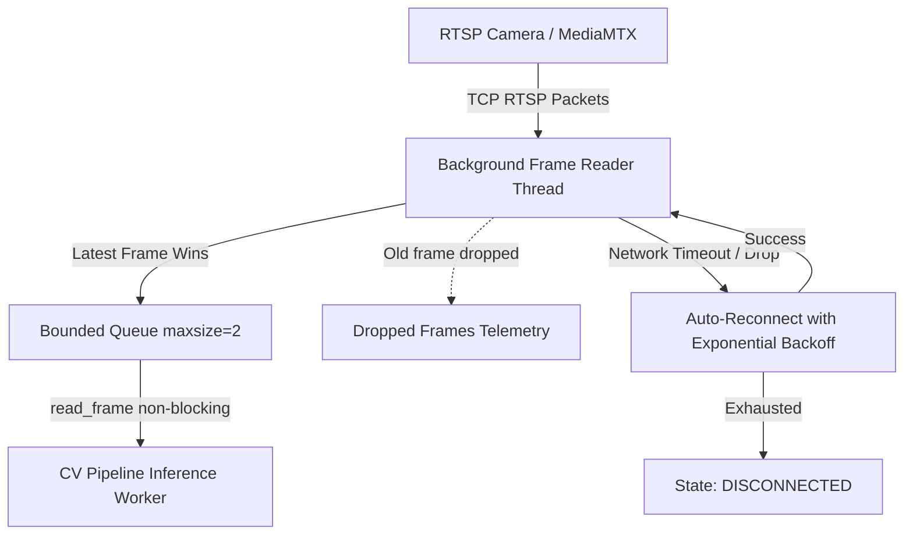

# RTSP / CCTV Deployment & Local Simulation Guide

## Overview
This document outlines how RTSP / CCTV cameras are configured, ingested, and simulated locally within the Anti-Proxy Attendance System. It details the toolchain, licenses, configuration format, stream resiliency, and operational monitoring.

---

## 1. CCTV Simulation Toolchain & Licenses

To develop and test RTSP ingestion locally without physical CCTV hardware, a lightweight RTSP server and video publisher are used.

### MediaMTX (RTSP Server)
- **Project**: [bluenviron/mediamtx](https://github.com/bluenviron/mediamtx) (formerly `rtsp-simple-server`)
- **License**: **MIT License** (Permissive open source, safe for local development, CI/CD, and production deployment).
- **Description**: A zero-dependency, high-performance RTSP / RTMP / WebRTC / HLS media server written in Go.
- **Local Startup**:
  ```bash
  # Docker execution
  docker run --rm -it --network=host bluenviron/mediamtx:latest

  # Or standalone binary execution
  ./mediamtx
  ```
  By default, MediaMTX listens on TCP port `8554` for RTSP.

### FFmpeg (Stream Publisher)
- **Project**: [FFmpeg](https://ffmpeg.org/)
- **License**: **LGPL v2.1+ / GPL v2+** (depending on build flags). Free for local development and CLI-based streaming.
- **Description**: Streams a local video file (e.g., MP4 recorded classroom clips) in a continuous loop to MediaMTX via RTSP over TCP.
- **Looping Stream Command**:
  ```bash
  ffmpeg -re -stream_loop -1 -i clips/scenario_entry.mp4 \
    -c:v copy -f rtsp -rtsp_transport tcp rtsp://localhost:8554/cam_room101_door
  ```
- **Helper Tool**:
  The project includes `vision-service/tools/publish_local_rtsp.py` to automate stream configuration, command formatting, and stream inspection:
  ```bash
  python vision-service/tools/publish_local_rtsp.py \
    --video-path clips/classroom_door.mp4 \
    --stream-path cam_room101_door \
    --port 8554
  ```

---

## 2. Camera Configuration

Cameras are defined in JSON or YAML configuration files loaded by the Vision Service `MultiCameraRunner` or managed dynamically in the backend Camera Registry.

### Multi-Camera Configuration Example (`cameras_config.json`)
```json
[
  {
    "camera_id": "CAM_ROOM_101_ENTRY",
    "classroom_id": "ROOM_101",
    "role": "ENTRY",
    "source_type": "RTSP",
    "rtsp_url": "rtsp://localhost:8554/cam_room101_entry",
    "boundary_points": [[0.1, 0.5], [0.9, 0.5]],
    "entry_side": "bottom",
    "deadband_pixels": 15,
    "enabled": true
  },
  {
    "camera_id": "CAM_ROOM_101_EXIT",
    "classroom_id": "ROOM_101",
    "role": "EXIT",
    "source_type": "RTSP",
    "rtsp_url": "rtsp://localhost:8554/cam_room101_exit",
    "boundary_points": [[0.1, 0.5], [0.9, 0.5]],
    "entry_side": "top",
    "deadband_pixels": 15,
    "enabled": true
  }
]
```

### Camera Role Semantics
- **`ENTRY`**: The camera is situated at an entrance-only portal. The CV pipeline only generates `ENTRY` events when tracks cross the boundary line into the classroom. Reversals or exit movements are filtered out to prevent false session finalizations from ingress lanes.
- **`EXIT`**: The camera monitors an exit portal. Only `EXIT` events are emitted. Any inward motion is filtered out.
- **`BOTH`**: Standard bidirectional door monitoring where both `ENTRY` and `EXIT` events are recognized based on crossing direction.

---

## 3. RTSP Robustness Architecture

Physical RTSP video sources suffer from network jitter, dropped packets, and camera reboots. The system employs three layers of hardening in `RTSPVideoSource`:



1. **Decoupled Background Thread**: OpenCV's `VideoCapture` is continuously pumped in a dedicated background worker to prevent OS socket buffer buildup.
2. **Latest-Frame-Wins Bounded Queue**: The queue buffer is capped at `maxsize=2`. If downstream face recognition takes longer than frame ingestion, the oldest frame is discarded, ensuring the vision pipeline always processes real-time frames with zero latency accumulation.
3. **Exponential Backoff Reconnect**:
   $$\text{delay} = \min(\text{interval} \times \text{factor}^{\text{attempt}}, \text{max\_backoff})$$
   Reconnections automatically recover when network switches restart or stream publishers reconnect.
4. **State Machine**:
   - `CONNECTED`: Active decoding.
   - `DEGRADED`: Frame read timeouts or reconnection in progress.
   - `DISCONNECTED`: Reconnection attempts exhausted or camera intentionally closed.

---

## 4. Operational Monitoring & Health Heartbeats

Every `CameraWorker` reports telemetry back to FastAPI via `POST /api/v1/cameras/{camera_id}/heartbeat`:
- **Payload**:
  ```json
  {
    "state": "CONNECTED",
    "fps": 14.2,
    "dropped_frames": 12
  }
  ```
- **Security & Privacy**:
  - No video frames or images are ever transmitted to FastAPI.
  - Heartbeat requests are authenticated via the Vision API Key (`X-API-Key`).
  - Raw RTSP URLs and credentials are never logged or exposed in API responses.

---

## 5. Verification & Testing

To run the camera tests and simulated streams:
```bash
# 1. Run RTSP robustness and recovery tests
vision-service/.venv/Scripts/python.exe -m pytest vision-service/tests/test_rtsp_robustness.py vision-service/tests/test_rtsp_stream_recovery.py -v

# 2. Run multi-camera orchestration tests
vision-service/.venv/Scripts/python.exe -m pytest vision-service/tests/test_multi_camera_orchestration.py -v

# 3. Run backend multi-camera attendance integration test
backend/.venv/Scripts/python.exe -m pytest backend/tests/test_multi_camera_attendance_e2e.py -v
```
