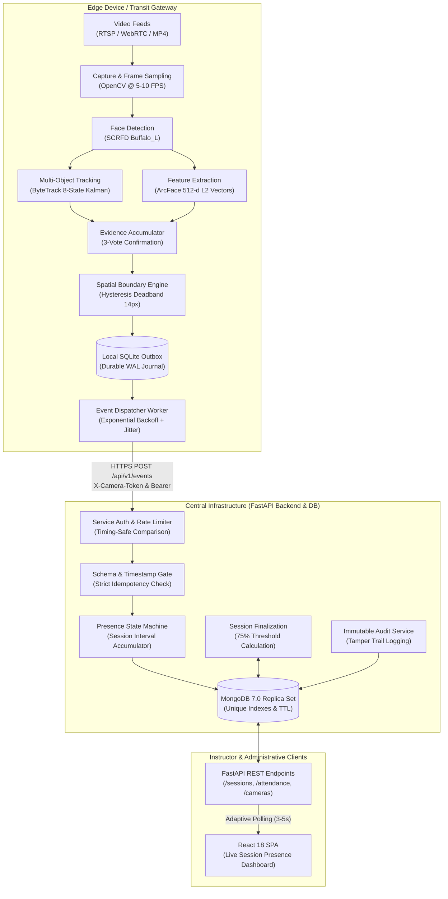

# System Architecture & Component Responsibilities

> [!NOTE]
> **Historical context.** This document was written when a phone could stream to the vision service over WebRTC on port 8088. That path has been removed (see [ADR-010](../adr/ADR-010-drop-webrtc-phone-ingest.md)). Frames now go from the browser to the backend, the vision service is internal only, and doorway mode is offline-tested with no live ingest. Passages below that describe WebRTC, the phone camera page or port 8088 as a public endpoint no longer apply.

## 1. System Overview

The **Anti-Proxy Automated Attendance System** is an enterprise-grade, edge-driven biometric attendance solution. The system is architected as an asynchronous, decoupled stack composed of three primary operational tiers:
1. **Edge Computer Vision Service**: Ingests video streams (WebRTC phone cameras, RTSP security cameras, or local MP4 files), detects faces, tracks identities across frames, detects directional transit across boundary thresholds, and persists transit events to an offline-capable outbox queue.
2. **FastAPI Application Backend**: Ingests transit events via cryptographically verified service-to-service endpoints, manages session lifecycles, computes continuous presence durations, enforces attendance policies, and maintains an immutable audit trail.
3. **React Frontend Application**: Provides real-time visibility into classroom sessions, displays live student presence states, visualizes camera operational health, and enables manual teacher interventions with mandatory justification auditing.



---

## 2. Component Responsibilities

### 2.1 Edge Vision Service (`/vision-service`)
The Vision Service encapsulates all perception and hardware-specific video processing. It runs entirely on the local network or edge gateway and has no direct access to the application database.
- **Hardware Abstraction Layer (`camera/`)**:
  - `PhoneCameraSource`: Ingests real-time WebRTC media streams from mobile browsers via an embedded `aiortc` signaling server on port `8088`.
  - `RTSPCameraSource`: Ingests standard CCTV/IP camera RTSP feeds with automated reconnection, backoff, and TCP transport enforcement.
  - `FileCameraSource`: Decodes offline video files for reproducible testing and benchmark verification.
- **Perception Pipeline (`pipeline/live_cv_pipeline.py`)**:
  - **Face Detection**: Uses InsightFace SCRFD (`det_size=(640, 640)`) to extract face bounding boxes and 5-point landmarks.
  - **Face Recognition**: Extracts 512-dimensional unit-normalized embeddings via ArcFace.
  - **Motion Tracking**: Maintains identity persistence across occlusions using a pure NumPy/SciPy implementation of ByteTrack with an 8-state Kalman filter.
  - **Evidence Fusion**: Maintains a sliding window evidence buffer for each active track. Confirms identity only when a student accumulates $\ge 3$ consistent votes with cosine similarity $\theta \ge 0.50$ and runner-up margin $\Delta \ge 0.15$.
  - **Virtual Boundary Engine**: Computes signed Euclidean distances of track centroids relative to a calibrated doorway line. Detects transitions across an empirical 14-pixel deadband to eliminate boundary jitter.
- **Reliable Ingestion & Outbox (`events/outbox.py`, `events/event_dispatcher.py`)**:
  - Commits all generated transit events to a local, thread-safe SQLite outbox (`outbox.db`) before attempting transmission.
  - Dispatches events via background worker threads using exponential backoff with randomized jitter (`secrets.randbelow`).
  - Guarantees zero event loss during backend restarts or intermittent network outages.

### 2.2 Application Backend (`/backend`)
The backend provides high-performance, asynchronous REST APIs built on FastAPI and Motor (asynchronous MongoDB driver).
- **Service-to-Service Security (`api/dependencies/camera_auth.py`)**:
  - Authenticates incoming camera events via timing-safe HMAC/SHA-256 tokens (`X-Camera-Token` or `Authorization: Bearer`).
  - Binds camera tokens to specific `camera_id` instances in the Camera Registry to prevent identity spoofing across classrooms.
  - Enforces payload size limits (64 KB) and in-memory rate limiting (600 requests/minute).
- **Presence Engine (`services/presence_engine.py`)**:
  - Resolves arriving events against active sessions in the camera's assigned classroom.
  - Accumulates presence duration by pairing chronological `ENTRY` and `EXIT` events.
  - Implements robust state recovery: handles missing exits (capped at session end), duplicate events (deduplicated via unique `event_id`), and out-of-order deliveries.
- **Session Lifecycle & Finalization (`services/session_finalization.py`)**:
  - Evaluates cumulative presence against the course's required presence threshold (default: 75%).
  - Assigns definitive `PRESENT`, `ABSENT`, or `PARTIAL` attendance marks.
  - Locks finalized records against subsequent modification except through formal administrative corrections.
- **Audit & Governance (`services/audit_service.py`)**:
  - Records every administrative and teacher modification (manual attendance overrides, camera updates) with actor ID, timestamp, prior state, new state, and mandatory justification.

### 2.3 Database Layer (MongoDB 7.0)
MongoDB provides schemaless persistence with strict document-level validation and compound indexes:
- **`users`**: User identities, roles (`ADMIN`, `TEACHER`, `STUDENT`), and bcrypt password hashes.
- **`student_profiles`**: Academic roll numbers, metadata, and user linkages.
- **`biometric_profiles`**: 512-dimensional mean embeddings, quality scores, and sample counts (no raw photos).
- **`cameras`**: Camera registry records, classroom bindings, operational roles (`ENTRY`, `EXIT`, `BOTH`), and health status.
- **`sessions`**: Attendance sessions with scheduled time bounds and required presence percentages.
- **`session_rosters`**: Enrolled student lists for each session.
- **`attendance_events`**: Chronological log of all ingested CV events with unique `event_id` constraints.
- **`attendance_records`**: Computed attendance results, presence ratios, and anomaly flags.
- **`audit_events`**: Immutable append-only audit trail.

### 2.4 Presentation Layer (`/frontend`)
Built as a responsive Single Page Application using React 18, TypeScript, Vite, and Vanilla CSS design tokens.
- **Teacher Dashboard**: Displays scheduled, active, and completed class sessions.
- **Live Attendance Feed**: Polls `/api/v1/sessions/{id}/live` adaptively (every 3–5 seconds), showing each student's current physical state (`INSIDE`, `OUTSIDE`, `NOT_SEEN`), real-time accumulated minutes, and projected attendance status.
- **Manual Overrides**: Allows teachers to override attendance marks with a single click, automatically opening a modal requiring an audit justification reason.
- **Camera Registry & Status**: Displays live ping times, frame rates, and last-seen timestamps for all classroom cameras.

---

## 3. Data Flow: From Video Frame to Finalized Attendance

```
1. Physical Transit:
   Student traverses classroom entrance -> Phone/RTSP camera captures 30 FPS stream.

2. Frame Sampling:
   OpenCV samples frame at 5-10 FPS -> Passes RGB numpy array to LiveCVPipeline.

3. Face Detection & Feature Extraction:
   SCRFD detects face bounding box [x1, y1, x2, y2] -> ArcFace computes 512-d vector -> Normalizes to unit sphere.

4. ByteTrack Association:
   Kalman filter predicts track location -> Hungarian algorithm associates detection to Track ID #42.

5. Evidence Accumulation:
   Track #42 compares vector against enrolled classroom gallery:
   Frame 1: Alice (sim=0.72) -> Vote 1
   Frame 2: Alice (sim=0.74) -> Vote 2
   Frame 3: Alice (sim=0.71) -> Vote 3 (3 votes achieved, top margin = +0.55 > 0.15).
   Identity confirmed as "alice_roll_101".

6. Boundary Crossing:
   Track #42 centroid moves from Y=560 (SIDE_A) through 14px deadband to Y=620 (SIDE_B).
   Direction resolved as ENTRY.

7. Outbox Persistence:
   Event JSON written to SQLite outbox with state=PENDING and unique event_id="evt_abc123".

8. Dispatched HTTP Request:
   Dispatcher sends POST /api/v1/events with X-Camera-Token header -> FastAPI validates key in timing-safe manner.

9. Presence Accumulation:
   Presence Engine queries active session for classroom "LH-101" -> Records ENTRY timestamp at 10:02:15 AM.
   State set to INSIDE.

10. Live UI Update:
    Teacher's browser polls /api/v1/sessions/{id}/live -> Receives updated state -> Renders green "INSIDE" badge.

11. Student Exit & Re-Entry:
    Student leaves at 10:45 AM (EXIT recorded, 42.75 min accumulated). Returns at 10:50 AM (ENTRY recorded).

12. Session Finalization:
    Teacher clicks "Finalize Session" at 11:00 AM (60 min total).
    Alice attended 52.75 min / 60 min = 87.9% (> 75% required).
    Alice marked PRESENT. Final record written to attendance_records collection.
```

---

## 4. Trust Boundaries & Security Architecture

1. **Network Boundary**:
   - The Vision Service and Camera Streams operate on a segregated Local Area Network (LAN) or local host.
   - The Backend API is accessible internally or over TLS.
2. **Machine-to-Machine Service Boundary**:
   - The `/api/v1/events` endpoint does NOT accept user credentials or cookies.
   - It requires a dedicated pre-shared secret key passed via `X-Camera-Token` or `Authorization: Bearer`.
   - Key verification utilizes `secrets.compare_digest` to prevent timing attack side channels.
3. **User Authentication Boundary**:
   - Application users authenticate via OAuth2 password flow (`POST /api/v1/auth/login`).
   - Sessions are protected via cryptographically signed JWTs (HS256, 32+ character high-entropy key, 60-minute expiration).
   - Role-Based Access Control (RBAC) strictly segregates `ADMIN`, `TEACHER`, and `STUDENT` permissions.
4. **Data Minimization Boundary**:
   - Raw facial photos and camera video streams are never transmitted to or stored in MongoDB.
   - Only 512-dimensional numerical float vectors (embeddings) and metadata timestamps are persisted.
