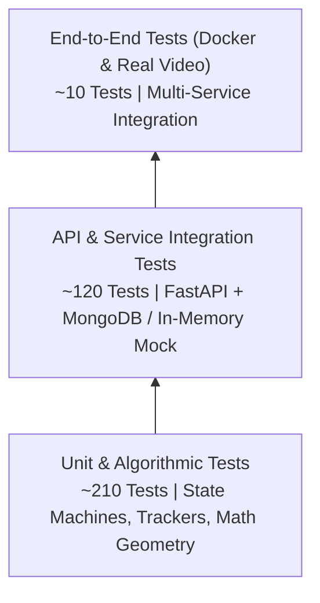

# Testing Guide & Quality Assurance Architecture

## 1. Testing Philosophy & Test Pyramid

The Anti-Proxy Attendance System enforces a multi-tiered testing strategy designed to guarantee mathematical accuracy, API resilience, and zero regression:



---

## 2. Test Suite Structure & Markers

### 2.1 Pytest Markers Reference
Both `backend/pytest.ini` and `vision-service/pytest.ini` define standardized markers:

| Marker | Description | Typical Run Time | Execution Command |
| :--- | :--- | :---: | :--- |
| **`unit`** | Isolated algorithmic tests with zero I/O or network. | < 5 seconds | `pytest -m unit` |
| **`integration`**| Multi-component or database integration tests. | 15 – 30 seconds | `pytest -m integration` |
| **`e2e`** | End-to-end flows spanning vision and API. | 30 – 60 seconds | `pytest -m e2e` |
| **`slow`** | Long-running video processing or stress benchmarks. | 1 – 3 minutes | `pytest -m slow` |
| **`needs_models`**| Requires downloaded InsightFace neural network weights. | 1 – 2 minutes | `pytest -m needs_models` |

---

## 3. Step-by-Step Test Execution Commands

### 3.1 Backend Test Suite (299 Tests)
The backend test suite verifies authentication, session state machines, presence accumulation, event idempotency, camera registry, and failure modes. It runs automatically with `mongomock-motor` if local MongoDB is not running:

```bash
# Activate backend environment:
cd backend
source .venv/bin/activate  # On Windows: .venv\Scripts\activate

# Run all 299 backend tests:
pytest tests -v

# Run with test coverage reporting:
pytest tests --cov=app --cov-report=term-missing

# Run fast unit tests only:
pytest tests -m "not slow"
```

### 3.2 Vision Service Fast Tests (44 Model-Free Tests)
These tests validate event dispatching, SQLite outbox durability, Kalman tracking logic, and boundary crossing geometry without loading deep learning models:

```bash
# Activate vision environment:
cd vision-service
source .venv/bin/activate  # On Windows: .venv\Scripts\activate

# Run fast model-free tests (< 20 seconds):
pytest tests/test_event_dispatcher.py tests/test_reliability_outbox.py tests/test_multi_person_robustness.py tests/test_rtsp_robustness.py tests/test_kinematic_anti_spoof.py -v
```

### 3.3 Vision Service Full Real-Face E2E Test
Runs actual high-definition video through live SCRFD face detection and ArcFace feature extraction into the FastAPI backend:

```bash
# Requires downloaded InsightFace models:
pytest tests/test_real_cv_attendance_e2e.py -v
```

### 3.4 Frontend Test Suites (12 Suites)
Executes TypeScript integration tests verifying authentication flows, live polling feeds, session rosters, and error handling:

```bash
cd frontend

# Run all 12 test suites:
npm test

# Run Oxlint static analysis:
npm run lint

# Run TypeScript compilation and production build:
npm run build
```

---

## 4. Full Stack Docker Smoke Test

A unified Python script validates the full running Docker Compose stack from outside the containers:

```bash
# Execute end-to-end smoke test against active stack:
python scripts/docker_smoke_test.py

# OR automatically start compose, run tests, and teardown:
python scripts/docker_smoke_test.py --docker-up --teardown
```

The smoke test exercises:
1. Container health checks (MongoDB, Backend, Frontend, Vision).
2. Administrative user registration and JWT retrieval.
3. Attendance session creation for a classroom.
4. Camera telemetry verification via `GET /cameras`.
5. Service-authenticated event posting (`POST /api/v1/events`).
6. Real-time attendance computation and live snapshot verification (`GET /sessions/{id}/live`).

---

## 5. Pre-Commit Quality & Security Verification

Before pushing code, run the unified pre-commit suite locally:

```bash
pre-commit run --all-files
```

Checks executed:
- Trailing whitespace & EOF fixer.
- YAML & JSON syntax validation.
- Merge conflict marker detection.
- Gitleaks secret detection across all files.
- Ruff Python linter and code formatter.
- Bandit AST security scanner.
