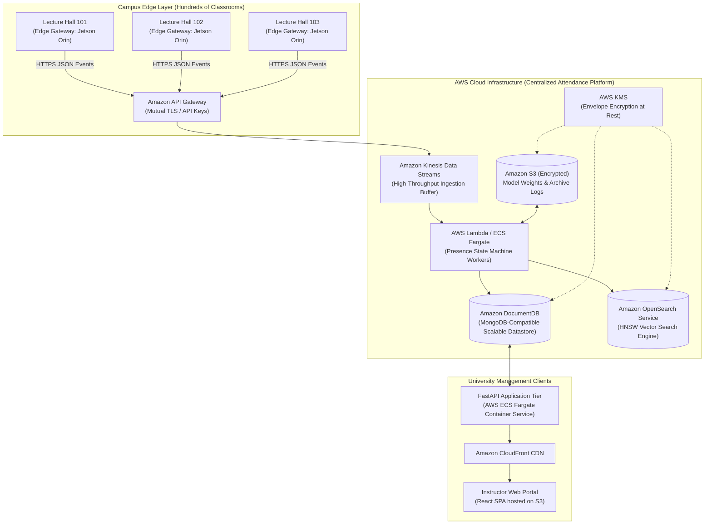

# Limitations, Next Phase Roadmap & AWS Cloud Architecture

## 1. Honest System Limitations (Current Local MVP)

Transparent evaluation of boundaries is essential for engineering integrity. The current system exhibits the following known constraints:

| Limitation Category | Current Local State | Impact on Operations | Recommended Mitigating Architecture |
| :--- | :--- | :--- | :--- |
| **1. Compute Throughput (CPU)** | Runs on standard CPU via ONNX Runtime (`~800–1200 ms` per sampled frame). | Effective sampling rate is limited to 5 FPS. High-speed sprinting through doorways could cause missed detections. | Offload inference to edge hardware accelerators (NVIDIA Jetson, Intel OpenVINO NPU, or Apple Silicon CoreML) to achieve $< 50\text{ ms}$ latency. |
| **2. Face-Only Tracking** | ByteTrack currently associates face bounding boxes rather than full-body person detections. | If a student turns their head $> 45^\circ$ or looks directly at their phone, the face detector drops, causing track fragmentation. | Implement two-stage person + face association (YOLOv8 person detector + ReID + ArcFace face verification on the person crop). |
| **3. High-Density Corridor Surges** | Calibrated for single/double file doorway transits (1–3 students crossing simultaneously). | In a dense rush of 20 students bursting through wide double doors, overlapping facial occlusions will reduce detection recall. | Deploy dual overhead wide-angle cameras with calibrated homography and stereo depth perspective. |
| **4. Passive Liveness Only** | Employs kinematic trajectory checks across boundary lines and temporal voting; lacks active 3D depth/NIR sensors. | A high-resolution curved video screen displaying a moving face could theoretically deceive the 2D camera if carried across the line. | Integrate active Near-Infrared (NIR) or Time-of-Flight (ToF) structured light cameras at high-security examination hall entrances. |
| **5. Biometric Search Scaling** | Gallery matching uses exhaustive BLAS matrix dot products ($N \times 512$). | Highly efficient for classroom rosters ($N \le 500$, $< 1\text{ ms}$), but scales linearly $O(N)$ for campus-wide galleries ($N \ge 50,000$). | Transition from linear scanning to Hierarchical Navigable Small World (HNSW) Approximate Nearest Neighbor (ANN) vector indexing. |

---

## 2. Next Phase Architecture: Hybrid AWS Cloud Deployment

To scale the system from a single department to a university-wide deployment across hundreds of lecture halls, the architecture will transition to a **Hybrid Edge-Cloud Topology**:

### Component Mapping & Cloud Strategy:
1. **Edge Perception (On-Premises)**:
   - Video decoding, SCRFD detection, ByteTrack tracking, and ArcFace feature extraction remain **strictly on the campus edge** (e.g., NVIDIA Jetson Orin Nano boards mounted above doorways).
   - Video never leaves the university campus, preserving bandwidth and student privacy.
2. **Event Ingestion (AWS API Gateway + Kinesis)**:
   - Edge nodes transmit compact JSON events (~200 bytes) over mTLS to Amazon API Gateway.
   - Amazon Kinesis Data Streams buffers incoming transit events from 500+ classrooms simultaneously, absorbing campus-wide class change surges (e.g., 10:00 AM class dismissal) without dropped events.
3. **Presence Engine & Compute (AWS ECS Fargate)**:
   - Containerized FastAPI presence engines run as auto-scaling serverless containers on AWS Fargate, automatically scaling compute based on active lecture periods.
4. **Vector Database (Amazon OpenSearch Service with k-NN)**:
   - Replaces in-memory NumPy matrix matching with distributed HNSW vector indexes, enabling sub-10ms similarity searches across 100,000+ enrolled students.
5. **Security & Cryptography (AWS KMS)**:
   - Hardware security modules (HSM) manage data encryption keys at rest for DocumentDB, OpenSearch, and S3 archives using envelope encryption.

---

## 3. Comparative Analysis: Custom Edge vs. AWS Rekognition

A common inquiry is why custom edge computer vision was selected over managed cloud vision APIs like **AWS Rekognition Face Search**:

| Dimension | Custom Edge Architecture (InsightFace + ByteTrack) | Commercial Cloud API (AWS Rekognition) | Architectural Winner & Rationale |
| :--- | :--- | :--- | :--- |
| **Operational Cost** | **Zero marginal cost** per transaction; utilizes local edge hardware ($300 one-time hardware cost per room). | **$0.001 per API call**. At 5 FPS for 50 classrooms = 900,000 calls/hr = **$900 per hour** ($7,200/day). | **Custom Edge**: Cloud API costs are financially impossible for educational institutions. |
| **Network Bandwidth** | **Zero uplink video bandwidth**. Only compact JSON transit events (~200 bytes) are sent to the network. | Requires streaming continuous 1080p video frames to the cloud (~2–4 Mbps per camera = **150+ Mbps campus uplink**). | **Custom Edge**: Avoids overwhelming campus network infrastructure. |
| **Student Privacy** | **Maximum privacy**. Raw video frames are discarded in edge RAM; zero imagery leaves campus. | Biometric facial imagery must be continuously transmitted to third-party commercial cloud servers. | **Custom Edge**: Preserves data sovereignty and avoids external data transfers. |
| **Tracking Continuity** | Continuous multi-frame Kalman tracking across the doorway with directional spatial boundary lines. | Independent frame analysis; no built-in spatial line crossing or trajectory state machines. | **Custom Edge**: Rekognition does not provide spatial boundary crossing geometry out of the box. |
| **Network Resilience** | Fully functional during campus internet outages via local SQLite outbox buffering. | **Fails immediately** if internet connectivity drops; classes cannot record attendance. | **Custom Edge**: Guarantees zero attendance loss during ISP disruptions. |
