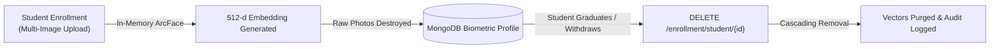

# Security, Privacy & Biometric Data Governance

> [!NOTE]
> **Historical context.** This document was written when a phone could stream to the vision service over WebRTC on port 8088. That path has been removed (see [ADR-010](../adr/ADR-010-drop-webrtc-phone-ingest.md)). Frames now go from the browser to the backend, the vision service is internal only, and doorway mode is offline-tested with no live ingest. Passages below that describe WebRTC, the phone camera page or port 8088 as a public endpoint no longer apply.

## 1. Biometric Data Architecture & Minimization

The Anti-Proxy Attendance System is designed under strict **data minimization** principles. Facial recognition systems in educational institutions carry inherent privacy risks; therefore, the architecture ensures that reversible facial imagery is never retained.

### 1.1 What the System Stores
| Data Category | Datastore / Location | Data Structure | Purpose |
| :--- | :--- | :--- | :--- |
| **Biometric Embeddings** | MongoDB `biometric_profiles` | 512-element floating point array (`list[float]`) | Non-reversible mathematical feature vectors representing facial geometry. |
| **Enrollment Metadata** | MongoDB `biometric_profiles` | Quality score (`float`), sample count (`int`), timestamp | Auditability and enrollment quality gating. |
| **Transit Events** | MongoDB `attendance_events` | Direction (`ENTRY`/`EXIT`), timestamp, track ID, confidence | Raw temporal log for presence duration calculation. |
| **Attendance Records** | MongoDB `attendance_records`| Total minutes, presence ratio, status (`PRESENT`/`ABSENT`) | Academic grading and attendance certification. |
| **User Credentials** | MongoDB `users` | Bcrypt password hash ($2b$12 salt) | User authentication and role assignment. |
| **Audit Log** | MongoDB `audit_events` | Actor ID, action, state diff, justification | Tamper-evident governance and change tracking. |

### 1.2 What the System NEVER Stores
- **NO Raw Facial Photos**: Raw JPEG/PNG enrollment photos are held temporarily in volatile memory during the enrollment request, converted into a normalized mean embedding, and **immediately destroyed**.
- **NO Cropped Face Chips**: Intermediate detection crops are processed in RAM and discarded after feature extraction.
- **NO Video Recordings**: Video streams (RTSP or WebRTC) are decoded frame-by-frame in memory. No surveillance video is recorded, saved to disk, or broadcast outside the local transit node.

---

## 2. Retention Lifecycles & Deletion Mechanisms

1. **Student Profile Deletion**:
   When an administrator deletes a student profile via the API, a cascading purge removes:
   - The user account in `users`.
   - The student record in `student_profiles`.
   - The biometric embedding in `biometric_profiles`.
   - The stored profile photo in the uploads volume.
   - The student's attendance records, the corrections made to them, doorway events, and the student's entries on session rosters.
   - One `STUDENT_DELETED` entry is recorded in `audit_events`, with the student's ID and counts only.
2. **Session Archiving**:
   Session transit events in `attendance_events` can be configured with automated MongoDB Time-To-Live (TTL) expiration (e.g., 90 days after academic term completion).
3. **Outbox Ephemerality**:
   Transit events stored on the edge device in `outbox.db` are deleted or marked `DELIVERED` immediately upon successful HTTP delivery.

---

## 3. Access Control & Authorization Boundaries

1. **Role-Based Access Control (RBAC)**:
   - **`ADMIN`**: Can enroll students, view system audit logs, and register cameras. Cannot alter finalized attendance without audit logging.
   - **`TEACHER`**: Can schedule sessions, monitor live feeds, finalize attendance, and apply manual corrections. Cannot access raw biometric galleries.
   - **`STUDENT`**: Can only view personal attendance records.
   - A new account of any role is `PENDING` until an administrator approves it, and a teacher's classes are assigned by an administrator. See [6.1](#61-teacher-accounts-could-be-self-registered).
   - Account management is described in [section 7](#7-account-management-and-passwords).
2. **Machine-to-Machine Isolation**:
   - Camera nodes authenticate via pre-shared service keys (`X-Camera-Token` or `Authorization: Bearer`).
   - Camera tokens grant access **exclusively** to the event ingestion endpoint (`POST /api/v1/events`). Camera tokens cannot access session records, user data, or administrative tools.

---

## 4. Anti-Spoofing & Liveness Strategy (Decision Record 2E.7)

### 4.1 Threat Model Summary
The threat model for classroom attendance involves four primary attack vectors:
1. **Printed 2D Paper Photos**: Attacker holds a printed photograph while walking past the camera.
2. **Screen Replay (Static Photo)**: Attacker holds a smartphone or tablet displaying an enrolled student's face.
3. **Screen Replay (Looped Video)**: Attacker plays a video of the student smiling or blinking.
4. **Virtual Stream Injection**: Attacker injects synthetic webcam frames directly into the WebRTC signaling connection.

### 4.2 Rationale for Postponing Heavy Neural Anti-Spoofing Models
In Step 2E.7, integrating dedicated deep learning anti-spoofing models (e.g., MiniFASNet, Silent-Face-Anti-Spoofing) was evaluated and intentionally **postponed** for the local MVP:
- **Excessive Latency**: Running an additional neural network per detected face increases CPU inference latency by 350–500 ms per frame, dropping pipeline frame rates below the minimum threshold required for smooth ByteTrack association.
- **Fragile Generalization**: 2D passive neural anti-spoofing models trained on public datasets generalize poorly across varied indoor lighting, fluorescent fixtures, and mobile camera lenses without active Infrared (IR) or structured 3D depth sensors.

### 4.3 Structural Architectural Mitigations
Instead of relying on a fragile, CPU-heavy neural liveness classifier, the system relies on **four structural mitigations** inherent to the anti-proxy architecture:
1. **Kinematic Boundary Crossing Trajectory**:
   Transit events are triggered **only** when a tracked face physically traverses a calibrated line across a 14-pixel deadband ($d < -7\text{px} \rightarrow d > +7\text{px}$). A photo held stationary, taped to a wall, or flashed momentarily generates **zero** transit events.
2. **Multi-Frame Temporal Voting**:
   The pipeline requires $\ge 3$ consistent identity matches across an active track window. Transient reflections, brief photo flashes, or partial occlusions fail to confirm.
3. **Continuous Presence Accumulation ($\ge 75\%$)**:
   **This is the core security guarantee of the system.** Attendance credit is awarded only if a student is confirmed inside the room for $\ge 75\%$ of class duration. Even if an attacker physically carried a photo across the doorway at 10:00 AM, the absence of persistent presence or an eventual `EXIT` transit results in automatic failure.
4. **Instructor Oversight & Social Deterrence**:
   Carrying an illuminated tablet or holding a photo at eye level while walking past an instructor and classroom peers is socially conspicuous and easily detected.

---

## 5. Explicit Limitations & Regulatory Disclaimer

> [!WARNING]
> **No Regulatory Compliance Claims:**
> This repository represents an **academic research prototype and engineering proof-of-concept**.
>
> The authors and contributors **make NO claims of formal certification or compliance** with statutory data protection frameworks, including:
> - The European Union General Data Protection Regulation (**GDPR** / Article 9 Biometric Processing)
> - The Family Educational Rights and Privacy Act (**FERPA** 34 CFR Part 99)
> - The Illinois Biometric Information Privacy Act (**BIPA** 740 ILCS 14)
> - The California Consumer Privacy Act (**CCPA**)
>
> Any university or commercial entity considering deployment in a real educational institution must:
> 1. Conduct a formal Data Protection Impact Assessment (DPIA).
> 2. Implement explicit, consent-driven opt-in enrollment protocols.
> 3. Provide an accessible non-biometric attendance alternative for non-consenting students.
> 4. Ensure cryptographic storage encryption at rest (e.g., LUKS, MongoDB Encrypted Storage Engine).

---

## 6. Known Security Gaps

Gaps that are known and not yet fixed. Each entry says who decided what, and what the fix will be.

### 6.1 Teacher accounts could be self-registered

**Status: fixed (2026-10-09).**

**What the gap was.** Anyone who could reach the API could register as a teacher and use the account at once, and a teacher with no assigned classes could create a session for any class. So an outsider could register, create a session for a class, and then see that class's roster, load its students' photos, and mark and export attendance.

**What closes it.**
- **Every registration is `PENDING` until an administrator approves it.** Student, teacher and bare account registration stay public, but a pending account cannot log in (the login answers "awaiting admin approval", and only after the correct password, so the message cannot be used to probe for accounts) and a token issued for a pending account is refused.
- **An administrator assigns a teacher's classes at approval.** Whatever the registration form asked for is kept only as a request.
- **A teacher can create a session only for an assigned class.** No assigned classes, no class given, or a class that is not assigned: 403. Administrators are exempt.
- **A teacher can add a registered student to a roster only from an assigned class.** Without this, a class-less roster edit would have been a way around the rule above.
- **A pending student is not a student yet.** Their photo and face template are stored for the administrator to review, but the template is not served to the vision service, and they do not appear on rosters, class lists or directories.
- **A photo change needs approval too.** An approved student who uploads a new photo keeps their current photo and template until an administrator approves the new one. Otherwise approval could be bypassed afterwards by swapping in someone else's face.
- **Rejecting removes everything.** A rejected registration is purged with the same code as deleting a student (photo, template and all), leaving one audit entry with IDs only. No stub is kept, so the person can register again. A registration nobody acts on is purged the same way after 14 days.
- **Public registration is rate-limited** per client address (5 per minute by default, across the three registration routes).

**What remains.** Approval is a human check: it is as good as the administrator's attention. The first administrator is created from two environment variables with no default password, and must be removed from the environment afterwards (the backend warns while they are still set).

### 6.2 Deleting a student did not remove everything

**Status: fixed (2026-10-08).**

`DELETE /api/v1/admin/students/{user_id}` used to remove only the user account, the student profile and the face template. It wrote no audit entry and left the stored photo, the attendance records and the roster entries behind. It also deleted whatever user ID it was given, including a teacher's or an administrator's.

It now removes everything held about the student, as section 2 describes: account, profile, face template, stored photo, attendance records and their corrections, doorway events, and the student's entries on session rosters. It asks the vision service to reload its gallery, and writes one `STUDENT_DELETED` audit entry holding the student's ID and the counts of what was removed, but not the name, email or any image data. It refuses accounts that are not students, and `DELETE /api/v1/admin/teachers/{user_id}` likewise refuses accounts that are not teachers.

Not removed, deliberately: earlier audit entries that mention the student's ID (the audit log is append-only), and the sessions themselves.

---

## 7. Account Management and Passwords

Added 2026-10-09. Every route here requires an administrator, except changing your own password.

**Passwords.**
- Passwords are stored only as bcrypt hashes. No route returns a password or a hash, and administrators cannot see an existing password.
- An account an administrator creates (student, teacher or administrator), the administrator created from `BOOTSTRAP_ADMIN_EMAIL` / `BOOTSTRAP_ADMIN_PASSWORD`, and any account whose password an administrator resets must choose a new password at the next sign-in. Until then every route answers 403 `password_change_required`; only `POST /api/v1/auth/change-password` works.
- A reset generates a random temporary password and returns it once, in the response to the administrator who asked. It is stored only as a hash and is not written to the log or the audit trail.
- Each user has a token version, carried in every token. Changing or resetting a password raises it in the same database update that stores the new hash, so every token issued before that is refused from then on. The caller of a password change gets a new token in the response.
- An administrator cannot reset their own password this way; they use the change-password form, which requires the current password.

**Editing accounts.**
- A student's name, email, class and student ID, and a teacher's name, email, teacher ID, department, classes and subjects can be edited. There is no route that changes a role.
- A student's ID is a label on the student record. Photos, face templates, session rosters and attendance records are keyed by an internal identity that never changes, and attendance views and CSV exports read the ID from the student record. Changing the ID is therefore a single-document update: nothing else is rewritten, and nothing can be left half-changed. The previous ID remains that student's internal identity, so it cannot be given to another student.
- Removing a class from a teacher takes effect on their next request: they can no longer open a session for it.

**Deleting accounts.**
- Deleting a student removes everything held about them (section 6.2).
- Deleting a teacher removes the account and profile only. The sessions they created and the attendance in them are kept as history. It is refused while one of their sessions is in progress.
- An administrator can delete another administrator, never themself, and never the last one.

**Audit.** Each action writes one entry: `ACCOUNT_CREATED`, `ACCOUNT_UPDATED` (the names of the fields that changed, not their values, plus class codes), `STUDENT_ID_CHANGED` (old and new ID), `PASSWORD_RESET`, `PASSWORD_CHANGED`, `TEACHER_DELETED`, `ADMIN_DELETED`. Entries hold IDs, roles and counts: no names, email addresses, passwords or images.

**What remains.**
- Tokens are not revoked individually: signing out on one device does not end a token (it expires after its lifetime). A password change or reset is the way to end every session at once.
- There is no self-service "forgot password": a reset needs an administrator, since the system sends no email.
- Password rules are a minimum length (8 characters; 12 for an administrator's first password). There is no check against known-breached passwords.

---

## 8. Classes and Subjects

Added 2026-10-09. Every route that changes the catalog requires an administrator.

- A class or subject is `ACTIVE` or `ARCHIVED`. Archiving hides it from registration, from new sessions and from new assignments. Students in the class, teachers who already have it, and past sessions and their attendance are all kept, and it can be restored.
- A class cannot be archived while one of its sessions is in progress.
- A class or subject is deleted only when nothing refers to it (no student, no teacher assignment, no session). Otherwise the request is refused and names what uses it.
- Once something refers to a class, its code, branch and section are fixed; likewise a subject's name. Students, teachers and sessions hold those values, so changing them would detach the history without anyone noticing.
- Creating a class or subject that already exists is refused (it used to overwrite the existing one silently). One class per branch and section.
- Registration, approval and the admin forms accept only an active class. A teacher can be given only active classes; one they already have stays theirs after it is archived, but they cannot open a new session for it.
- `GET /api/v1/academic/public/classes` needs no sign-in: the registration form has to list the classes before the person has an account. It returns the code, branch and section of active classes and nothing else. It is the only public route added, and the test that lists every public route was updated to name it.

**Audit.** `CLASS_CREATED`, `CLASS_UPDATED`, `CLASS_ARCHIVED`, `CLASS_UNARCHIVED`, `CLASS_DELETED` and the same five for subjects, with the class code or subject ID, the names of changed fields, and usage counts.

- A session and a teacher assignment accept only a subject that exists in the catalog and is active (added 2026-10-09). A subject a teacher already had before this rule stays when they are edited for something else; only a subject being added is checked.
- `GET /api/v1/academic/classes/{class_code}/students` answers only an administrator or a teacher assigned to that class. Everyone else, including a student of that class, gets 403, and the answer is the same for a class that does not exist.
- The browser client holds no service key. It used to carry a built-in default camera key for a doorway "simulator" in the session page; the key, the simulator and the ENTRY/EXIT buttons that depended on it were removed. Doorway events are sent only by cameras, with `VISION_SERVICE_API_KEY`.

**What remains.**
- `VISION_SERVICE_API_KEY` must be a random value in every deployment. The value that used to be built into the client is public (it is in this repository's history) and must not be used anywhere.
- Sessions created before the subject rule may carry a subject that is not in the catalog; they are kept as they are.
