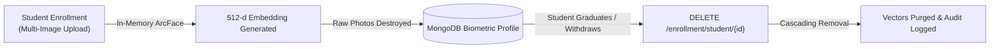

# Security, Privacy & Biometric Data Governance

## 1. Biometric Data Architecture & Minimization

The Anti-Proxy Attendance System is designed under strict **data minimization** principles. Facial recognition systems in educational institutions carry inherent privacy risks; therefore, the architecture ensures that reversible facial imagery is never retained.

### 1.1 What the System Stores
| Data Category | Datastore / Location | Data Structure | Purpose |
| :--- | :--- | :--- | :--- |
| **Biometric Embeddings** | MongoDB `biometric_profiles` | 512-element floating point array (`list[float]`) | Non-reversible mathematical feature vectors representing facial geometry. |
| **Enrollment Metadata** | MongoDB `biometric_profiles` | Quality score (`float`), sample count (`int`), timestamp | Auditability and enrollment quality gating. |
| **Transit Events** | MongoDB `attendance_events` | Direction (`ENTRY`/`EXIT`), timestamp, track ID, confidence | Raw temporal log for presence duration calculation. |
| **Attendance Records** | MongoDB `attendance_records`| Total minutes, presence ratio, status (`PRESENT`/`ABSENT`) | Academic grading and attendance certification. |
| **User Credentials** | MongoDB `users` | Bcrypt password hash ($2b$12 salt) | User authentication and role assignment. |
| **Audit Log** | MongoDB `audit_events` | Actor ID, action, state diff, justification | Tamper-evident governance and change tracking. |

### 1.2 What the System NEVER Stores
- **NO Raw Facial Photos**: Raw JPEG/PNG enrollment photos are held temporarily in volatile memory during the enrollment request, converted into a normalized mean embedding, and **immediately destroyed**.
- **NO Cropped Face Chips**: Intermediate detection crops are processed in RAM and discarded after feature extraction.
- **NO Video Recordings**: Video streams (RTSP or WebRTC) are decoded frame-by-frame in memory. No surveillance video is recorded, saved to disk, or broadcast outside the local transit node.

---

## 2. Retention Lifecycles & Deletion Mechanisms

1. **Student Profile Deletion**:
   When an administrator deletes a student profile via the API, a cascading purge removes:
   - The user account in `users`.
   - The student record in `student_profiles`.
   - The biometric embedding in `biometric_profiles`.
   - An immutable record of the deletion action is recorded in `audit_events`.
2. **Session Archiving**:
   Session transit events in `attendance_events` can be configured with automated MongoDB Time-To-Live (TTL) expiration (e.g., 90 days after academic term completion).
3. **Outbox Ephemerality**:
   Transit events stored on the edge device in `outbox.db` are deleted or marked `DELIVERED` immediately upon successful HTTP delivery.

---

## 3. Access Control & Authorization Boundaries

1. **Role-Based Access Control (RBAC)**:
   - **`ADMIN`**: Can enroll students, view system audit logs, and register cameras. Cannot alter finalized attendance without audit logging.
   - **`TEACHER`**: Can schedule sessions, monitor live feeds, finalize attendance, and apply manual corrections. Cannot access raw biometric galleries.
   - **`STUDENT`**: Can only view personal attendance records.
2. **Machine-to-Machine Isolation**:
   - Camera nodes authenticate via pre-shared service keys (`X-Camera-Token` or `Authorization: Bearer`).
   - Camera tokens grant access **exclusively** to the event ingestion endpoint (`POST /api/v1/events`). Camera tokens cannot access session records, user data, or administrative tools.

---

## 4. Anti-Spoofing & Liveness Strategy (Decision Record 2E.7)

### 4.1 Threat Model Summary
The threat model for classroom attendance involves four primary attack vectors:
1. **Printed 2D Paper Photos**: Attacker holds a printed photograph while walking past the camera.
2. **Screen Replay (Static Photo)**: Attacker holds a smartphone or tablet displaying an enrolled student's face.
3. **Screen Replay (Looped Video)**: Attacker plays a video of the student smiling or blinking.
4. **Virtual Stream Injection**: Attacker injects synthetic webcam frames directly into the WebRTC signaling connection.

### 4.2 Rationale for Postponing Heavy Neural Anti-Spoofing Models
In Step 2E.7, integrating dedicated deep learning anti-spoofing models (e.g., MiniFASNet, Silent-Face-Anti-Spoofing) was evaluated and intentionally **postponed** for the local MVP:
- **Excessive Latency**: Running an additional neural network per detected face increases CPU inference latency by 350–500 ms per frame, dropping pipeline frame rates below the minimum threshold required for smooth ByteTrack association.
- **Fragile Generalization**: 2D passive neural anti-spoofing models trained on public datasets generalize poorly across varied indoor lighting, fluorescent fixtures, and mobile camera lenses without active Infrared (IR) or structured 3D depth sensors.

### 4.3 Structural Architectural Mitigations
Instead of relying on a fragile, CPU-heavy neural liveness classifier, the system relies on **four structural mitigations** inherent to the anti-proxy architecture:
1. **Kinematic Boundary Crossing Trajectory**:
   Transit events are triggered **only** when a tracked face physically traverses a calibrated line across a 14-pixel deadband ($d < -7\text{px} \rightarrow d > +7\text{px}$). A photo held stationary, taped to a wall, or flashed momentarily generates **zero** transit events.
2. **Multi-Frame Temporal Voting**:
   The pipeline requires $\ge 3$ consistent identity matches across an active track window. Transient reflections, brief photo flashes, or partial occlusions fail to confirm.
3. **Continuous Presence Accumulation ($\ge 75\%$)**:
   **This is the core security guarantee of the system.** Attendance credit is awarded only if a student is confirmed inside the room for $\ge 75\%$ of class duration. Even if an attacker physically carried a photo across the doorway at 10:00 AM, the absence of persistent presence or an eventual `EXIT` transit results in automatic failure.
4. **Instructor Oversight & Social Deterrence**:
   Carrying an illuminated tablet or holding a photo at eye level while walking past an instructor and classroom peers is socially conspicuous and easily detected.

---

## 5. Explicit Limitations & Regulatory Disclaimer

> [!WARNING]
> **No Regulatory Compliance Claims:**
> This repository represents an **academic research prototype and engineering proof-of-concept**.
>
> The authors and contributors **make NO claims of formal certification or compliance** with statutory data protection frameworks, including:
> - The European Union General Data Protection Regulation (**GDPR** / Article 9 Biometric Processing)
> - The Family Educational Rights and Privacy Act (**FERPA** 34 CFR Part 99)
> - The Illinois Biometric Information Privacy Act (**BIPA** 740 ILCS 14)
> - The California Consumer Privacy Act (**CCPA**)
>
> Any university or commercial entity considering deployment in a real educational institution must:
> 1. Conduct a formal Data Protection Impact Assessment (DPIA).
> 2. Implement explicit, consent-driven opt-in enrollment protocols.
> 3. Provide an accessible non-biometric attendance alternative for non-consenting students.
> 4. Ensure cryptographic storage encryption at rest (e.g., LUKS, MongoDB Encrypted Storage Engine).
