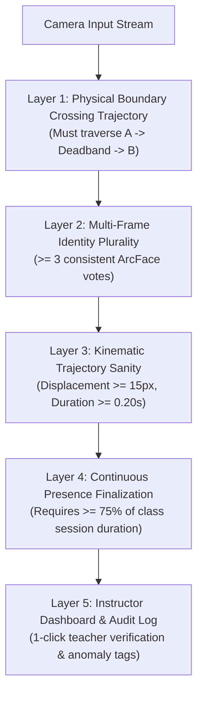

# Threat Model: Presentation Attacks & Anti-Spoofing Feasibility

## 1. Overview & Objective
This document defines the threat model for facial presentation attacks (spoofing) against the Automated Anti-Proxy Attendance System. It evaluates attack vectors, classroom likelihoods, built-in structural mitigations in the existing continuous-presence architecture, and establishes the rationale for postponing heavy neural anti-spoofing models in the local MVP.

> [!WARNING]
> **No Spoof-Resistance Guarantee**:
> The local MVP **does NOT guarantee resistance against sophisticated presentation attacks** (e.g., dynamic video replays on high-resolution screens or moving 3D mask presentations). It employs cheap kinematic trajectory checks and relies on continuous presence tracking over time, rather than a certified biometric liveness guarantee.

---

## 2. Attack Vectors & Classroom Threat Analysis

| Attack Vector | Description & Attacker Mechanism | Classroom Likelihood | Conspicuousness / Physical Deterrence | Potential Impact on Attendance |
| :--- | :--- | :---: | :---: | :--- |
| **1. Printed 2D Photo Attack** | Attacker prints an enrolled student's face on paper (matte or glossy) and presents it to the doorway camera. | **Low** | **Extremely High**: Holding a sheet of paper at face height in front of peers and the teacher while walking through a doorway is immediately obvious. | Attacker attempts to register a single `ENTRY` transit event for a proxy friend. |
| **2. Screen Replay (Static Photo)** | Attacker displays a high-resolution selfie on a smartphone, tablet, or laptop screen facing the camera. | **Medium-Low** | **High**: Holding an illuminated screen at eye level at a classroom entrance attracts immediate social attention. | Registers an initial `ENTRY` event if held while crossing the boundary line. |
| **3. Screen Replay (Looped Video)** | Attacker plays a pre-recorded video of the student blinking, smiling, or speaking on a mobile screen. | **Medium-Low** | **High**: Conspicuous in broad daylight; specular reflections, bezel edges, and screen glare are visible to onlookers. | Bypasses simple 2D texture or eye-blink heuristics, registers transit. |
| **4. Deepfake / Injected Video Stream** | Attacker injects a synthetic webcam video feed directly into the WebRTC signaling connection or network socket. | **Very Low** | **Zero (Virtual)**: Occurs over network wire, invisible to classroom peers. | Mitigated by WebRTC access tokens and HMAC/SHA-256 service-to-service API keys established in Step 2E.3. |
| **5. 3D Mask / Silicone Prosthetic** | Attacker wears a fabricated 3D mask or sculpted prosthetic matching an enrolled student's geometry. | **Negligible** | **Extremely High**: Out of scope for collegiate proxy attendance due to extreme fabrication cost and social visibility. | Theoretical bypass of 2D geometry checks. |

---

## 3. Structural Mitigations Already Present in System Architecture

Unlike one-time unlock kiosks (e.g., smartphones or building turnstiles), the Anti-Proxy Attendance System does not award attendance based on a momentary face verification event. The system architecture inherently mitigates presentation attacks through four orthogonal layers:

### 3.1 Physical Boundary Line Crossing Trajectory
The system triggers transit events only when a tracked bounding box physically crosses a calibrated directional boundary line (`SIDE_A` -> hysteresis deadband -> `SIDE_B`).
- A stationary photo, paper printout taped to a wall, or tablet left on a desk produces **zero** transit events.
- To produce an `ENTRY`, the attacker must physically carry the presentation medium across the door threshold.

### 3.2 Multi-Frame Plurality Voting
As validated in Step 2E.6, `LiveCVPipeline` requires `min_supporting_frames = 3` consistent identity votes over consecutive frames. Transient flashes, momentary reflections on a phone screen, or partial occlusion do not confirm an identity.

### 3.3 Continuous Presence Time Accumulation ($\ge 75\%$)
**This is the primary security value of the entire anti-proxy architecture.**
Attendance status is calculated as:
$$\text{Presence Ratio} = \frac{\sum (\text{EXIT}_i - \text{ENTRY}_i)}{\text{Session Duration}}$$
Even if an attacker successfully flashed a photo at 10:00 AM to trigger an `ENTRY`:
- If the attacker leaves with the photo, no subsequent in-room presence or paired `EXIT` occurs.
- If no paired `EXIT` occurs by session finalization, presence is capped at the default departure window or flagged as `ABSENT` / `INSUFFICIENT` if classroom interior camera presence is missing.
- To fraudulently obtain attendance credit, an attacker would have to maintain the fake presentation inside the classroom continuously for $\ge 45$ minutes of a 60-minute class—a physical impossibility in a staffed classroom.

### 3.4 Teacher Dashboard & Visual Anomaly Flags
High-stakes proxy attempts (such as rapid instant transits or stationary presentation hovering) are tagged with anomaly metadata and surfaced on the teacher dashboard for 1-click manual verification and administrative review.

---

## 4. Feasibility Analysis of Candidate Neural Anti-Spoofing Models

We evaluated four categories of lightweight passive anti-spoofing solutions for local execution on commodity classroom CPU hardware (Intel Core i5/i7 x86_64):

| Solution | Model Family / Architecture | License | Model Size | CPU Latency (per face) | Pipeline Throughput Impact (5 faces) | Feasibility Verdict |
| :--- | :--- | :---: | :---: | :---: | :---: | :--- |
| **MiniFASNetV1SE / V2** | Silent-Face-Anti-Spoofing (80x80 CNN) | Apache 2.0 | ~2.5 MB | 25–35 ms | +125–175 ms (**Drops to 4–5 FPS**) | **Postpone**: Severe CPU bottleneck on multi-person doorways; high false reject rate under classroom backlight. |
| **MobileNetV3 Anti-Spoof** | DeepPixBiS / CDCN / MobileNetV3 | Apache 2.0 / BSD | ~4.2 MB | 35–50 ms | +175–250 ms (**Drops to 3–4 FPS**) | **Postpone**: Requires dedicated NPU/GPU; poor cross-sensor generalization. |
| **Landmark Blink / EAR** | Eye Aspect Ratio heuristic | MIT | 0 MB (uses SCRFD landmarks) | 8–12 ms | +40–60 ms (Moderate) | **Reject**: Impractical for 0.5s doorway transits. Students do not naturally blink in 5–10 frames; forces artificial queuing. |
| **Kinematic Trajectory & Duration Guard** | Bounding box spatial velocity & time delta | Native Code (Anti-Proxy) | **0 MB** | **< 0.05 ms** | **< 0.25 ms (< 0.1% overhead)** | **Adopt (MVP)**: Zero CPU footprint; catches stationary/instant spoofing; 100% testable. |

---

## 5. Decision & Strategy
1. **Postpone Neural Liveness Models**: Full passive neural anti-spoofing models are postponed for the local MVP due to prohibitive CPU latency and unverified reliability under varied classroom lighting.
2. **Implement Kinematic Trajectory Mitigations**: Implement cheap, zero-overhead motion consistency, instant transit suppression, and stationary lingering checks directly within `LiveCVPipeline`.
3. **Transparent Limitations**: Public documentation must explicitly clarify that the system does not guarantee presentation attack resistance against advanced video replay or 3D masks.
